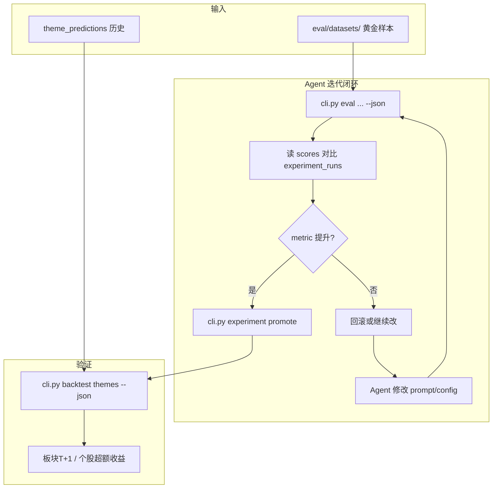

# CLI / 评估 / 回测 / Agent 优化 — 初步设计

> 记录时间: 2026-05-26  
> 状态: **初步设计（待主人审阅）**  
> 关联: [架构方案.md](./架构方案.md) · [review_report.md](./review_report.md) · [盘后数据获取-初步设计.md](./盘后数据获取-初步设计.md)  
> 参考: [doc/reports/05-23-2100-Tushare题材数据源对比.md](../doc/reports/05-23-2100-Tushare题材数据源对比.md)

---

## 1. 文档目的

在现有 **三段式流水线**（`crawl_sync` → `clean_sync` → `analyze` + 题材抽取）之上，新增一套可被 **Agent / 脚本 / CI** 调用的能力层，支撑：

1. **CLI 化** — 无 GUI 依赖地执行爬取、清洗、分析、统计
2. **离线评估（Eval）** — 对新闻分析 prompt、题材抽取 prompt、清洗规则打分
3. **题材回测（Backtest）** — 将 `theme_predictions` 与 Tushare 行情对齐，验证 T+1/T+3 预测力
4. **实验管理（Experiment）** — prompt 版本化、A/B 对比、晋升/回滚
5. **Agent 半自动优化闭环** — Agent 读 eval/backtest JSON → 改配置 → 再跑 → 对比

本文档为 **Phase 0～2 的初步设计**，不含具体实现代码；审阅通过后按第 12 节顺序落地。

---

## 2. 背景与现状

### 2.1 已有能力（可直接复用）

| 模块 | 路径 | 说明 |
|------|------|------|
| 业务服务 | `services/crawl_sync_service.py` | 爬取 → 去重 → `raw_news` |
| 业务服务 | `services/clean_sync_service.py` | AI 清洗 → 更新 `clean_status` |
| 业务服务 | `services/analysis_service.py` | 分析 → 报告 `.md` → 可选题材抽取 |
| Agent 函数导出 | `agent/__init__.py` | `crawl_sync` / `clean_sync` / `analyze_news` / `get_db_stats` |
| 定时执行 | `services/scheduled_runner.py` | 按 `schedule_tasks.json` 的 `type` 分发 |
| 题材存储 | `services/storage/theme_store.py` | 三表快照：`theme_predictions` / `theme_stocks` / `theme_news` |
| 题材抽取 | `core/theme_extractor.py` | 硬编码 `_SYSTEM_PROMPT`，流式 JSON 抽取 |
| 分析 Prompt | `config/ai_config.json` → `prompt_templates` | 5 套模板，GUI 可编辑 |
| 清洗规则 | `config/cleaning_criteria.json` | v1.4 已有人工抽样评估经验 |
| Prompt 调试 | `tools/show_ai_input.py` | 已有 argparse 模式，可借鉴 CLI 风格 |
| 行情导出 | `tools/export_tushare_theme_daily.py` | Tushare 板块数据，文档明确用于回测选型 |

### 2.2 核心痛点

| 领域 | 现状问题 | 影响 |
|------|----------|------|
| **调用方式** | 仅 GUI + Python import；`agent/` 无 CLI/MCP | 外部 Agent 调用成本高 |
| **分析 Prompt** | 改模板无版本、无自动评分 | 无法 A/B，Agent 改完不知好坏 |
| **题材抽取 Prompt** | 硬编码在 `theme_extractor.py`，与分析模板分离 | 优化需改代码，难实验 |
| **题材存储** | 只有预测快照，无事后涨跌、无标准板块映射 | `get_theme_history` 只看预测演化，无法验证准确度 |
| **题材名对齐** | 自由文本 `theme_name` vs 行情标准名 | 文档已指出无法稳定 T+1 验证 |
| **实验追溯** | 报告未记录使用的 `template_id`、抽取 prompt 版本 | 回测无法关联到具体实验 |

### 2.3 设计原则

1. **业务零重复** — CLI / Eval / Backtest 只包装现有 `services/` 与 `core/`，不重写爬虫/分析逻辑
2. **无 GUI 依赖** — CLI 入口不 import `PyQt5`
3. **机器可读** — 所有命令支持 `--json`，stdout 仅输出 JSON，进度/日志走 stderr
4. **可复现** — 每次 eval/backtest 写入 `experiment_runs`，记录参数 hash 与结果
5. **半自动优化** — Agent 可自动跑实验；**prompt 晋升需 metric 提升**（可选人工 approve）
6. **渐进交付** — Phase 0 CLI → Phase 1 Eval → Phase 2 Backtest → Phase 3 MCP

---

## 3. 总体架构

### 3.1 分层图

```
┌─────────────────────────────────────────────────────────────┐
│  调用层                                                      │
│  cli.py (Phase 0)          agent/mcp_server.py (Phase 3 可选) │
└───────────────────────────────┬─────────────────────────────┘
                                │
┌───────────────────────────────▼─────────────────────────────┐
│  实验层 (新建 eval/)                                         │
│  EvalRunner → scorers (analyze / theme / clean)              │
│  ExperimentStore → experiment_runs 表                        │
└───────────────────────────────┬─────────────────────────────┘
                                │
┌───────────────────────────────▼─────────────────────────────┐
│  回测层 (新建 services/backtest_service.py)                  │
│  ThemeCanonicalMapper → TushareMarketData → BacktestEngine   │
└───────────────────────────────┬─────────────────────────────┘
                                │
┌───────────────────────────────▼─────────────────────────────┐
│  现有业务层 (不动核心逻辑)                                     │
│  services/*  +  core/*  +  services/storage/*                │
└─────────────────────────────────────────────────────────────┘
```

### 3.2 Agent 优化闭环



---

## 4. CLI 设计（Phase 0）

### 4.1 入口与初始化

**文件**: `cli.py`（项目根目录）

**启动链**:

```
cli.py::main()
  → bootstrap()
      → core.env_loader.load_dotenv(.env)
      → services.storage.database.init_database()
  → argparse 解析子命令
  → 对应 handler
  → emit_result(dict, json_mode) → stdout
  → sys.exit(exit_code)
```

**约束**:

- 禁止 import `gui/`、`PyQt5`
- 默认 `--json` 为 false（人类可读）；Agent 调用时必须传 `--json`
- 退出码: `0` 成功 / `1` 业务失败 / `2` 参数错误 / `130` 用户中断

### 4.2 子命令一览

| 命令 | 映射 | 用途 |
|------|------|------|
| `crawl` | `services.crawl_sync_service.crawl_sync` | 爬取入库 |
| `clean` | `services.clean_sync_service.clean_sync` | 清洗增量 |
| `analyze` | `services.analysis_service.analyze_news` | 生成分析报告 |
| `stats` | `agent.get_db_stats` | 库内统计 |
| `pipeline` | 组合 crawl → clean → analyze | 一键日流程 |
| `market fetch` | `MarketSummaryService.build` | 盘后数据获取（见 [盘后数据获取-初步设计.md](./盘后数据获取-初步设计.md)） |
| `market show/validate` | `MarketSummaryStore` | 查看/校验盘后数据 |
| `eval analyze` | `eval/runner.run_analyze_eval` | 分析 prompt 评估 |
| `eval theme` | `eval/runner.run_theme_eval` | 题材抽取评估 |
| `eval clean` | `eval/runner.run_clean_eval` | 清洗规则评估 |
| `eval market` | `eval/runner.run_market_eval` | 盘后数据质量评估 |
| `backtest themes` | `services.backtest_service.run_theme_backtest` | 题材回测 |
| `backtest compare` | `ExperimentStore.compare_runs` | 实验对比 |
| `experiment list/create/promote` | `eval/experiment_store.py` | 实验管理 |
| `theme normalize` | `ThemeCanonicalMapper.batch_normalize` | 题材名映射（预览/写入） |

### 4.3 关键命令参数（草案）

#### `analyze`

```
--source {curated,raw}     默认 curated
--hours INT                最近 N 小时（与 --start/--end 互斥）
--start / --end            "YYYY-MM-DD HH:MM:SS"
--template ID              prompt_templates 键名
--provider ID              覆盖 current_provider
--extract-themes / --no-extract-themes
--max-news INT
--json
```

#### `pipeline`

```
--crawl / --no-crawl       是否爬取（默认 true）
--clean / --no-clean       是否清洗（默认 true）
--analyze / --no-analyze   是否分析（默认 true）
--auto-clean               crawl 后串联 clean（默认 true）
... 继承 analyze 参数 ...
```

#### `eval analyze`

```
--template ID              待评模板（可多次指定做对比）
--cases PATH               JSONL 用例文件（见 6.2）
--dry-run                  只 dump prompt，不调 LLM
--judge-provider ID        LLM-as-Judge 用的 provider（默认 deepseek + flash）
--json
```

#### `backtest themes`

```
--from DATE                起始 report_date
--to DATE                  结束 report_date
--horizon 1,3,5            持有期（交易日）
--benchmark {index,none}   超额基准，默认沪深300
--min-score INT            只回测 strength_score >= N
--json
```

### 4.4 统一输出格式

**成功响应** (`--json`):

```json
{
  "ok": true,
  "command": "analyze",
  "data": {
    "report_path": "data/AI_analysis/2026-05-26/xxx.md",
    "news_count": 42,
    "theme_count": 8
  },
  "meta": {
    "elapsed_ms": 125000,
    "experiment_id": "exp_20260526_001"
  }
}
```

**失败响应**:

```json
{
  "ok": false,
  "command": "analyze",
  "error": "选定时间范围内没有新闻数据",
  "error_code": "NO_NEWS"
}
```

**进度日志**（stderr，不影响 JSON 解析）:

```
[2026-05-26 16:00:01] 加载新闻: 42 条
[2026-05-26 16:00:05] AI 分析中...
```

### 4.5 与现有代码关系

| 现有 | CLI 层职责 |
|------|-----------|
| `agent/__init__.py` | CLI handler 直接 import 这些函数 |
| `services/scheduled_runner.py` | `pipeline` 子命令复用其参数映射逻辑 |
| `tools/show_ai_input.py` | `eval analyze --dry-run` 可内部复用其 prompt dump 链 |
| `main.py` | GUI 入口不变；CLI 与之平行 |

---

## 5. MCP 设计（Phase 3，可选）

### 5.1 定位

MCP 是 CLI 的 **IDE 协议适配层**，不是第二套业务逻辑。

**原则**: MCP tool 内部 **直接调 Python 函数**（同 CLI handler），不 subprocess 绕圈。

### 5.2 文件与 Tool 映射

**文件**: `agent/mcp_server.py`

| MCP Tool | 映射 |
|----------|------|
| `crawl_news` | `crawl_sync(...)` |
| `clean_news` | `clean_sync(...)` |
| `analyze_news` | `analyze_news(...)` |
| `get_db_stats` | `get_db_stats()` |
| `run_eval` | `EvalRunner.run(...)` |
| `run_backtest` | `BacktestService.run_theme_backtest(...)` |
| `list_experiments` | `ExperimentStore.list_runs(...)` |

### 5.3 Cursor 配置示例

```json
{
  "mcpServers": {
    "news-trading": {
      "command": "python",
      "args": ["-m", "agent.mcp_server"],
      "cwd": "D:/爬虫"
    }
  }
}
```

### 5.4 依赖

- `requirements.txt` 新增 `mcp>=1.0`（Phase 3 再装，Phase 0 不引入）

---

## 6. 评估模块设计（Phase 1）

### 6.1 目录结构

```
eval/
├── __init__.py
├── runner.py              # EvalRunner：调度各 scorer
├── experiment_store.py    # 读写 experiment_runs 表
├── datasets/
│   ├── analyze_cases.jsonl      # 分析黄金样本
│   ├── theme_reports.jsonl      # 题材抽取黄金样本
│   └── clean_samples.jsonl      # 清洗标注样本
└── scorers/
    ├── base.py            # Scorer 抽象：score(case) -> ScoreResult
    ├── analyze_scorer.py  # 分析报告评分
    ├── theme_scorer.py    # 题材抽取评分
    ├── clean_scorer.py    # 清洗评分
    └── llm_judge.py       # LLM-as-Judge 共用
```

### 6.2 数据集格式

#### `analyze_cases.jsonl`（每行一条）

```json
{
  "case_id": "20260522_short_term_01",
  "source": "curated",
  "start": "2026-05-22 09:00:00",
  "end": "2026-05-22 15:00:00",
  "template_id": "short_term",
  "market_summary_path": "分析数据/模板/三位一体盘后数据_2月5日.md",
  "gold_report_path": "eval/datasets/gold/20260522_short_term.md",
  "rubric_notes": "人工标注：必须提到机器人板块，引用新闻107"
}
```

#### `theme_reports.jsonl`

```json
{
  "case_id": "theme_20260522_01",
  "report_path": "data/AI_analysis/2026-05-22/5月22日_18时25分_盘后总结分析报告.md",
  "gold_themes_path": "eval/datasets/gold/themes_20260522.json",
  "notes": "人工确认题材列表与 priority_rank"
}
```

#### `clean_samples.jsonl`

```json
{
  "case_id": "clean_001",
  "news_id": "abc123",
  "title": "...",
  "content": "...",
  "gold_decision": "keep",
  "gold_reason": "政策类-国家级"
}
```

**初期规模建议**: 每类 **10～20 条** 即可启动闭环；后续扩到 50+ 再考虑 DSPy。

### 6.3 分析评分器（`analyze_scorer.py`）

**调用链**:

```
EvalRunner.run_analyze_eval(template_id, cases)
  → for case in cases:
      → AnalysisService.analyze(...)           # 或用 cache 报告路径
      → AnalyzeScorer.score(report_path, case)
          → FormatScorer.check(report_text)    # 规则
          → CitationScorer.check(report, news) # 规则
          → LLMJudge.score(report, rubric)     # 可选
      → 聚合为 case_score
  → 写入 experiment_runs
  → 返回汇总 metrics
```

**指标定义**:

| 指标 ID | 类型 | 计算方式 | 权重（默认） |
|---------|------|----------|-------------|
| `format_compliance` | 规则 | 必须章节存在：新闻分级、板块机会、优先级排序、风险提示 | 0.25 |
| `citation_valid_rate` | 规则 | `[新闻X](#新闻X)` 中 X 是否对应输入新闻编号 | 0.25 |
| `anchor_db_id_rate` | 规则 | 报告底部 `**数据库ID**` 是否填充 | 0.10 |
| `sector_count_ok` | 规则 | 板块数在模板预期范围内 | 0.10 |
| `judge_quality` | LLM | 1～10 分，对比 rubric_notes / gold_report | 0.30 |

**汇总**:

```
total_score = Σ (weight_i × metric_i)
pass = total_score >= 0.75 AND citation_valid_rate >= 0.9
```

### 6.4 题材抽取评分器（`theme_scorer.py`）

**调用链**:

```
EvalRunner.run_theme_eval(cases)
  → for case:
      → ThemeExtractor.extract_from_file(report_path)
      → ThemeScorer.score(themes, news_id_map, case)
  → experiment_runs
```

**指标定义**:

| 指标 ID | 类型 | 说明 |
|---------|------|------|
| `schema_valid_rate` | 规则 | JSON 解析成功 + 必填字段 |
| `news_id_map_rate` | 规则 | `theme_news.news_id` 反查成功率 |
| `priority_rank_match` | 规则 | 与报告「板块优先级排序」一致性 |
| `stock_code_fill_rate` | 规则 | `stock_code` 非空比例 |
| `duplicate_theme_rate` | 规则 | 同报告重复 `theme_name`（越低越好） |
| `gold_theme_recall` | 对比 | 与 `gold_themes_path` 的题材名 F1 |
| `hallucination_rate` | LLM/人工 | 报告未提及的题材/标的占比 |

### 6.5 清洗评分器（`clean_scorer.py`）

复用 `.huiye/架构方案.md` §12 的 v1.4 评估方法论：

| 指标 | 说明 |
|------|------|
| `accuracy` | 与 `gold_decision` 一致率 |
| `false_positive_rate` | 应 remove 却 keep |
| `false_negative_rate` | 应 keep 却 remove |
| `reason_readable_rate` | `clean_reason` 非默认值比例 |

### 6.6 LLM-as-Judge（`llm_judge.py`）

**输入**: 报告全文 + rubric +（可选）gold 报告  
**输出**: `{score: 1-10, reasoning: str, issues: []}`
**模型**: 默认 `deepseek-v4-pro`（thinking=disabled，JSON 输出稳定）
**注意**: Judge 结果波动大，仅作辅助指标，不能单独决定 prompt 晋升

---

## 7. 回测模块设计（Phase 2）

### 7.1 业务目标

回答三类问题：

1. **板块级**: `strength_score` 高的题材，对应标准板块在 T+1 是否更强？
2. **个股级**: `theme_stocks` 推荐标的，T+1/T+3 超额收益如何？
3. **排序级**: `priority_rank` top3 vs bottom3 是否有单调性？

### 7.2 模块与调用链

```
cli.py backtest themes
  → BacktestService.run_theme_backtest(from, to, horizons)
      → ThemeStore 查询 theme_predictions + theme_stocks
      → ThemeCanonicalMapper.resolve(theme_name) → canonical_code
      → TushareMarketData.get_sector_return(code, date, horizon)
      → TushareMarketData.get_stock_return(stock_code, date, horizon)
      → BacktestEngine.aggregate(predictions, returns)
      → BacktestResultStore.save(results)
      → 返回汇总 JSON
```

### 7.3 题材名标准化（`ThemeCanonicalMapper`）

**问题**: AI 输出 `具身智能/人形机器人`，行情侧可能是东财 `人形机器人` 或同花顺 `机器人概念`。

**数据源优先级**（与 [Tushare 对比报告](../doc/reports/05-23-2100-Tushare题材数据源对比.md) 一致）:

1. **东财概念** `dc_index`（`idx_type=概念板块`）— 板块涨跌主数据源
2. **同花顺概念** `ths_index` — 备选 / 交叉验证
3. **关键词模糊匹配** — 复用 `export_tushare_theme_daily.py` 的 `THEME_KEYWORDS`

**映射策略**:

```
resolve(theme_name):
  1. 查 theme_canonical_map 表（人工/历史确认过的映射，最高优先）
  2. 精确匹配 dc_index.name
  3. 模糊匹配（包含关系 + 关键词表）
  4. 失败 → mark unmatched，回测跳过并计入 unmatched_rate
```

**新表 `theme_canonical_map`**:

```sql
CREATE TABLE IF NOT EXISTS theme_canonical_map (
    id              INTEGER PRIMARY KEY AUTOINCREMENT,
    theme_name_raw  TEXT NOT NULL UNIQUE,    -- AI 原始名
    canonical_name  TEXT NOT NULL,           -- 行情标准名
    source          TEXT NOT NULL,           -- 'dc' / 'ths' / 'manual'
    source_code     TEXT,                    -- 板块代码
    match_method    TEXT NOT NULL,           -- 'exact' / 'fuzzy' / 'manual'
    confidence      REAL NOT NULL DEFAULT 1.0,
    updated_at      TEXT NOT NULL
);
```

### 7.4 回测结果存储

**新表 `theme_backtest_results`**:

```sql
CREATE TABLE IF NOT EXISTS theme_backtest_results (
    id                  INTEGER PRIMARY KEY AUTOINCREMENT,
    theme_prediction_id INTEGER NOT NULL,   -- FK theme_predictions.id
    report_date         TEXT NOT NULL,
    theme_name          TEXT NOT NULL,
    canonical_name      TEXT,
    canonical_code      TEXT,
    horizon_days        INTEGER NOT NULL,   -- 1 / 3 / 5
    sector_return       REAL,               -- 板块涨跌幅 %
    stock_avg_return    REAL,               -- 关联标的平均收益 %
    stock_hit_rate      REAL,               -- 上涨标的占比
    benchmark_return    REAL,               -- 基准（沪深300）收益 %
    excess_return       REAL,               -- 超额收益
    match_status        TEXT NOT NULL,      -- 'matched' / 'unmatched' / 'partial'
    computed_at         TEXT NOT NULL,
    FOREIGN KEY (theme_prediction_id) REFERENCES theme_predictions(id) ON DELETE CASCADE
);
CREATE INDEX IF NOT EXISTS idx_backtest_date ON theme_backtest_results(report_date, horizon_days);
CREATE INDEX IF NOT EXISTS idx_backtest_theme ON theme_backtest_results(theme_name);
```

### 7.5 回测汇总指标

| 指标 | 计算 |
|------|------|
| `score_monotonicity` | 按 strength_score 分桶（80+/60-79/...），各桶 T+1 平均 sector_return 是否递减 |
| `rank_ic` | priority_rank 与 T+1 return 的 Spearman 相关 |
| `top3_avg_excess` | 每报告 rank≤3 题材的平均超额 |
| `unmatched_rate` | 无法映射标准板块的比例 |
| `stock_hit_rate_avg` | 推荐标的 T+1 上涨比例均值 |

### 7.6 Tushare 接口复用

基于现有 `tools/export_tushare_theme_daily.py` 封装 `TushareMarketData`:

| 方法 | Tushare API | 用途 |
|------|-------------|------|
| `get_sector_return(code, trade_date, horizon)` | `dc_daily` / `dc_index` | 板块 T+N 收益 |
| `get_stock_return(code, trade_date, horizon)` | `daily` | 个股 T+N 收益 |
| `get_index_return('000300.SH', ...)` | `index_daily` | 基准超额 |

**缓存**: 回测结果落库后不必重复拉 API；原始行情可缓存在 `data/tushare_cache/`（JSON，按 trade_date 分文件）。

---

## 8. 实验管理设计

### 8.1 新表 `experiment_runs`

```sql
CREATE TABLE IF NOT EXISTS experiment_runs (
    id              TEXT PRIMARY KEY,       -- exp_20260526_001
    run_type        TEXT NOT NULL,          -- 'eval_analyze' / 'eval_theme' / 'eval_clean' / 'backtest'
    name            TEXT,                   -- 人类可读名
    config_snapshot TEXT NOT NULL,          -- JSON: template_id, prompt_hash, provider, params
    metrics         TEXT NOT NULL,          -- JSON: 各 scorer 指标
    pass            INTEGER,                -- 0/1/NULL
    baseline_id     TEXT,                   -- 对比基线 experiment_id
    delta_metrics   TEXT,                   -- JSON: 与 baseline 差值
    created_at      TEXT NOT NULL,
    notes           TEXT
);
CREATE INDEX IF NOT EXISTS idx_exp_type ON experiment_runs(run_type, created_at DESC);
```

### 8.2 Prompt 版本化

**问题**: 分析 prompt 在 `ai_config.json`，题材 prompt 在代码常量，无法统一追溯。

**方案 A（推荐，Phase 1）**:

- 分析模板：继续在 `ai_config.json`，但 eval 时计算 `prompt_hash = sha256(system + user)`
- 题材抽取：将 `_SYSTEM_PROMPT` / `_USER_PROMPT_TEMPLATE` **外置**到 `config/theme_extraction_prompt.json`（与 `theme_extraction` 配置段并列）
- 每次 `analyze` / `extract` 在报告元数据或 `experiment_runs.config_snapshot` 记录 hash

**方案 B（Phase 2+）**:

- 新表 `prompt_versions(id, kind, content, hash, created_at, promoted_at)`
- `experiment promote` 时将 winning version 写入 `ai_config.json` 或 `theme_extraction_prompt.json`

### 8.3 `experiment promote` 规则

```
promote(experiment_id):
  1. 读取 experiment_runs.metrics
  2. 与当前 production baseline 对比
  3. 必须满足:
     - total_score 提升 >= 0.02（可配置）
     - citation_valid_rate 不得下降
     - backtest top3_avg_excess 不得显著变差（若已有回测数据）
  4. 写入 config 文件 + 更新 baseline 指针
  5. 记录 promoted_from experiment_id
```

**默认**: 需 `--force` 或环境变量 `EXPERIMENT_AUTO_PROMOTE=1` 才真正写 config；否则只输出 diff 预览。

---

## 9. 存储层扩展汇总

### 9.1 现有表（不变）

- `raw_news` / `sync_meta`
- `theme_predictions` / `theme_stocks` / `theme_news`

### 9.2 新增表

| 表 | Phase | 用途 |
|----|-------|------|
| `theme_canonical_map` | 2 | 题材名 → 行情标准名 |
| `theme_backtest_results` | 2 | 预测事后验证 |
| `experiment_runs` | 1 | 实验记录 |
| `prompt_versions` | 2（可选） | Prompt 版本库 |

### 9.3 现有表建议扩展（Phase 2，可选）

`theme_predictions` 增加列（需 migration）:

```sql
prompt_hash       TEXT,    -- 抽取时用的 prompt 版本
analysis_template TEXT,    -- 来源报告使用的分析模板 ID
canonical_name    TEXT,    -- 冗余存储映射结果，加速查询
```

**迁移策略**: 与现有 `_migrate_theme_tables_v2` 类似，新增列用 `ALTER TABLE ADD COLUMN`，不 DROP 数据。

---

## 10. Prompt 外置与优化策略

### 10.1 分析 Prompt（`config/ai_config.json`）

- **短期**: 不改存储位置，eval 只读现有 `prompt_templates`
- **优化方式**: Agent 修改 JSON 中某 template → 跑 `eval analyze` → 对比分数
- **注意**: `build_user_prompt` 的 cache 友好分段逻辑不变（见 `core/ai_news_analyzer.py`）

### 10.2 题材抽取 Prompt（需外置）

**新文件** `config/theme_extraction_prompt.json`:

```json
{
  "version": "1.0.0",
  "system_prompt": "...",
  "user_prompt_template": "...",
  "changelog": [
    {"version": "1.0.0", "date": "2026-05-26", "note": "从 theme_extractor.py 迁出"}
  ]
}
```

**改动点**:

- `ThemeExtractor.__init__` 优先读 JSON，fallback 到模块内常量（兼容）
- `eval theme` 支持 `--prompt-file` 指定实验版本，不写回 config

### 10.3 清洗规则（`config/cleaning_criteria.json`）

- 已有 v1.4 评估基础
- `eval clean` 直接调 `NewsCleaner(criteria).clean_news_list` 对样本批跑

### 10.4 是否引入 DSPy

| 阶段 | 建议 |
|------|------|
| 样本 < 30 | **不用**，Agent + eval 手动迭代 |
| 样本 30～100 | 可选，仅用于生成 prompt **候选**，人工/adopt 规则晋升 |
| 样本 > 100 | 可考虑 DSPy BootstrapFewShot 优化清洗/抽取 |

**原因**: 金融场景 fully-automated prompt search 幻觉风险高，必须有人类 gold set 兜底。

---

## 11. Agent 使用规范（Cursor Rule 草案）

建议在 `.cursor/rules/` 或项目文档中约定：

1. **改 prompt 前** 必须跑对应 `eval` 并记录 `experiment_id`
2. **改 prompt 后** 必须对比 baseline，`total_score` 下降则禁止 merge
3. **改题材存储 schema 前** 必须写 migration 说明
4. **回测结论** 不得基于 `unmatched_rate > 20%` 的数据集
5. **LLM Judge 分数** 不能作为唯一晋升依据

**典型 Agent 会话命令序列**:

```bash
python cli.py stats --json
python cli.py eval analyze --template short_term --cases eval/datasets/analyze_cases.jsonl --json
python cli.py eval theme --cases eval/datasets/theme_reports.jsonl --json
python cli.py backtest themes --from 2026-05-01 --to 2026-05-22 --horizon 1,3 --json
python cli.py experiment compare --baseline exp_xxx --candidate exp_yyy --json
```

---

## 12. 目标目录结构（实施后）

```
NewsTrading/
├── cli.py                          # Phase 0 CLI 入口
├── agent/
│   ├── __init__.py                 # 已有函数导出
│   └── mcp_server.py               # Phase 3
├── eval/                           # Phase 1
│   ├── runner.py
│   ├── experiment_store.py
│   ├── datasets/
│   └── scorers/
├── services/
│   ├── backtest_service.py         # Phase 2
│   ├── market_data/                # Phase 2
│   │   ├── tushare_client.py
│   │   └── theme_canonical_mapper.py
│   └── storage/
│       ├── database.py             # 扩展 migration
│       └── backtest_store.py       # Phase 2
├── config/
│   ├── ai_config.json
│   ├── cleaning_criteria.json
│   └── theme_extraction_prompt.json  # Phase 1 外置
└── data/
    ├── news.db
    ├── experiments/                # 可选：大体积 eval 报告缓存
    └── tushare_cache/              # Phase 2 行情缓存
```

---

## 13. 实施计划

### Phase 0 — CLI 基础（预估 1～2 天）

| 任务 | 产出 |
|------|------|
| `cli.py` bootstrap + 子命令 crawl/clean/analyze/stats/pipeline | 可 subprocess 调用 |
| 统一 `--json` 输出与 exit code | Agent 可解析 |
| README 增加 CLI 章节 | 文档 |
| `agent/__init__.py` 补充序列化 helper | 减少重复 |

**验收**: `python cli.py stats --json` 返回库统计；`python cli.py analyze --hours 24 --json` 在无 GUI 下跑通。

### Phase 1 — Eval + 实验（预估 1 周）

| 任务 | 产出 |
|------|------|
| `eval/` 模块 + `experiment_runs` 表 | 可跑 eval |
| 整理 10 条 analyze / theme / clean 黄金样本 | `eval/datasets/` |
| 题材 prompt 外置到 JSON | 可 A/B 不改代码 |
| `cli eval *` + `cli experiment *` | 命令可用 |

**验收**: 同一报告跑两次 eval，分数可复现（允许 LLM Judge 小幅波动）；experiment 记录可 list/compare。

### Phase 2 — 回测（预估 1 周）

| 任务 | 产出 |
|------|------|
| `theme_canonical_map` + `theme_backtest_results` 表 | schema 就绪 |
| `ThemeCanonicalMapper` + `TushareMarketData` | 映射 + 行情 |
| `BacktestService` + `cli backtest themes` | 可量化验证 |
| 复跑历史 5～10 个交易日回测 | 基线 metrics |

**验收**: 对已有 `theme_predictions` 数据，T+1 回测产出 `score_monotonicity` 等指标；unmatched 题材可人工补映射。

### Phase 3 — MCP + 自动化（可选，预估 2～3 天）

| 任务 | 产出 |
|------|------|
| `agent/mcp_server.py` | Cursor 集成 |
| Cursor rule / Agent 工作流文档 | 半自动优化 |

---

## 14. 风险与对策

| 风险 | 对策 |
|------|------|
| LLM API 成本高（eval 频繁调） | `--dry-run`；报告 cache；eval 子集采样 |
| 题材名映射失败率高 | 人工维护 `theme_canonical_map`；CLI `theme normalize --interactive` |
| Judge 分数不稳定 | 固定 judge prompt + 低 temperature；多次采样取中位数 |
| 回测过拟合历史 | 分 train/holdout 时间段；晋升看 holdout |
| SQLite 锁 | CLI 与 GUI 共用 WAL；回测批量写入单事务 |
| 无 gold 样本 | Phase 1 并行整理；先用规则指标（format/citation/schema） |

---

## 15. 待主人确认

- [ ] **回测优先级**: 板块涨跌 vs 个股超额 vs 两者都要（默认：两者都要，板块优先）
- [ ] **Tushare 板块主数据源**: 东财 `dc_index` 是否定为唯一标准（文档倾向是）
- [ ] **prompt 晋升**: 全自动 vs 必须人工 approve（默认：人工 approve，`promote --force` 可选）
- [ ] **Phase 0 是否同步做 MCP**（默认：否，CLI 先行）
- [ ] **现有历史报告是否纳入 gold set**（需主人标注 10～20 份）
- [ ] **`theme_predictions` 是否加 `analysis_template` / `prompt_hash` 列**（建议 Phase 2 加）

---

## 16. 关键调用链速查

### 16.1 日流程（CLI）

```
cli pipeline
  → crawl_sync()
  → clean_sync()          # auto_clean
  → analyze_news()
      → AINewsAnalyzer.analyze()
      → _maybe_extract_themes()
          → ThemeExtractor.extract_from_file()
          → ThemeStore.save_themes()
```

### 16.2 分析 Eval

```
cli eval analyze
  → EvalRunner.run_analyze_eval()
      → AnalysisService.analyze()
      → AnalyzeScorer.score()
          → FormatScorer / CitationScorer / LLMJudge
      → ExperimentStore.save_run()
```

### 16.3 题材回测

```
cli backtest themes
  → BacktestService.run_theme_backtest()
      → ThemeStore.get_by_date()
      → ThemeCanonicalMapper.resolve()
      → TushareMarketData.get_sector_return()
      → BacktestResultStore.save()
      → 聚合 metrics
```

---

## 17. 一句话总结

**CLI 让 Agent 能调；Eval 让 Agent 知道改得好不好；Backtest 让题材预测可验证；Experiment 让一切可复现。** 四层都建在现有 `services/` 之上，不推翻 GUI，不重写流水线。

---

*审阅通过后，从 Phase 0 `cli.py` 开始实施。*
