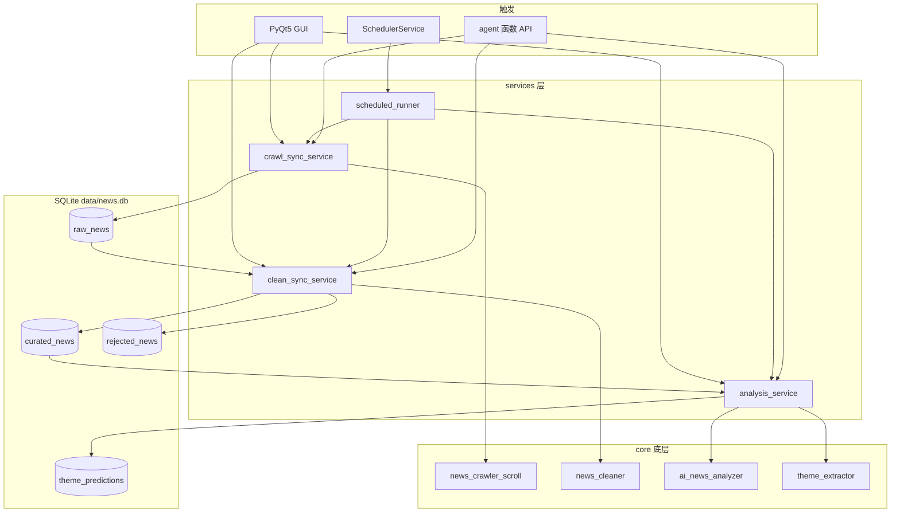

# 项目代码 Review 报告（第三轮）

> 评审者: 辉夜  
> 评审时间: 2026-05-23  
> 项目: A股新闻爬虫与 AI 分析系统 (`e:\NewsTrading`)  
> 评审范围: 全量代码 + `.huiye` 架构文档 + Git 追踪面  
> 代码规模: **44** 个 Python 文件（不含 `.huiye` 调试脚本），约 **9,463** 行  

---

## 🔥 摘要（TL;DR）

| 等级 | 数量 | 说明 |
|------|------|------|
| 🔴 严重 (Critical) | 0 | 密钥未进 Git；增量逻辑已走 SQLite `published_ts` |
| 🟠 高危 (High) | 3 | README/旧文档严重脱节；`schedule_tasks.json` 被 Git 追踪；零测试 |
| 🟡 中危 (Medium) | 6 | print 日志、页面 eager load、Agent 未落地、裸 except 残留等 |
| 🟢 建议 (Low) | 8 | 懒加载、文档索引、LICENSE 缺失等 |

**与第二轮对比**：P0 架构重构 **已完成**——`workflows/`、`db_helper`、JSON 主存储、双调度器、H1 增量 mtime 问题均已消除。当前主要债务是 **文档与 README 未同步**，以及 **工程化（测试/日志/Agent）** 缺口。

---

## ✅ 已修复 / 已落地（第二轮 → 第三轮）

| 编号 | 问题 | 现状 |
|------|------|------|
| H1 | 增量边界用文件 mtime | `RawStore.get_latest_news()` → `ORDER BY published_ts DESC` |
| H2 | db_helper 命名误导 | 已删除；`services/storage/raw_store.py` |
| H3 | 双调度器重叠 | 仅 `SchedulerService` + `scheduled_runner` |
| H6 | AI 调用重复 | `_stream_chat` / `_call_provider` 统一 |
| — | workflows 假编排 | 目录已删；三段式 `crawl_sync` / `clean_sync` / `analyze` |
| M1 | data_page 去重注释错误 | 已无「10 分钟 + 80%」残留 |
| M8 | sqlalchemy 未使用 | 已从 `requirements.txt` 移除 |
| — | 存储层 | SQLite `data/news.db`（gitignore）；7218+ 条已迁移 |

**新增能力（第三轮可见）**：
- 题材预测库 `theme_predictions` + GUI「预测题材」页
- 清洗标准 v1.4 + DeepSeek V4 分流（分析 v4-pro / 清洗 v4-flash）
- 定时任务支持 `interval_hours` 与 `crawl_sync` 后自动 `clean_sync`
- `agent/__init__.py` 导出 `crawl_sync` / `clean_sync` / `analyze_news` 函数级 API（非 MCP）

---

## 🟠 High（高危）

### H1. README 与真实项目严重脱节 — **已修复（2026-05-23）**

已重写 `README.md`：启动脚本、依赖文件、SQLite 架构、`services/` 流水线、定时任务格式、`.env` 配置等与代码一致。仍缺独立 `LICENSE` 文件（README 已不再声称 MIT）。

### H2. `doc/` 大量文档仍描述已删除的 workflows

`doc/features/任务流*.md`、`doc/guides` 部分章节仍引用 `workflows/`、`WorkflowEngine`。代码已变，文档成为**主动误导**。

### H3. 零自动化测试

`parse_news_time`、去重、增量截断、`ThemeExtractor` JSON 修复、清洗 `_parse_decisions` 兜底等核心逻辑均无 `tests/`。重构后风险靠人工点 GUI，不可接受（辉夜强迫症发作）。

---

## 🟡 Medium（中危）

### M1. `core/` 仍以 `print()` 为主（约 60+ 处）

`news_crawler_scroll.py` 占大头。打包 EXE 无控制台时日志丢失；与 `SchedulerService` 的 logging 体系割裂。

### M2. `MainWindow` 启动时同步创建 7 个 Page

`DataPage` 等可能在 `__init__` 扫库/扫盘，拖慢冷启动。建议 `QStackedWidget` 懒加载。

### M3. Agent 仅函数导出，无 MCP Server

`agent/__init__.py` 有 `crawl_sync` 等，但 `架构方案.md` Step 6 `mcp_server.py` 仍为 ⏳。外部 Agent 无法标准接入。

### M4. 裸 `except:` 残留 3 处

`gui/pages/export_page.py`（2）、`core/news_exporter.py`（1）。会吞 `KeyboardInterrupt`。

### M5. `AIConfig` 模块级单例 + GUI 明文写 Key

`ai_config = AIConfig()` import 即读盘；`set_api_key` 仍写 `config/ai_config.json`。`.env` 优先已做，但 GUI 保存路径仍有本地泄漏面。

### M6. `data/schedule_tasks.json` 被 Git 追踪

含个人任务名、`last_run`、调度间隔。应改为 `schedule_tasks.example.json` + gitignore 实文件。

### M7. 题材表 v2 迁移 = DROP 重建

`database.py::_migrate_theme_tables_v2()` schema 不一致时清空三张表。设计合理但需在 UI/文档标明「升级丢历史题材」。

---

## 🟢 Low（建议）

| # | 问题 |
|---|------|
| L1 | 缺少 `core/__init__.py`，依赖 `sys.path.insert` |
| L2 | 打包路径逻辑分散（`main.py` / `main_window.py` / crawler） |
| L3 | `chrome-win64/` 体积大，需在 README 说明分发方式 |
| L4 | `tools/` 为手工脚本，非 pytest |
| L5 | `.huiye/_debug_*` 调试产物可考虑 gitignore |
| L6 | Windows 控制台 emoji 可能 `UnicodeEncodeError` |
| L7 | `news_exporter.py` 与 ExportPage 功能重叠（架构方案已标注评估） |
| L8 | 无 `pyproject.toml` / ruff / mypy，代码风格靠自觉 |

---

## 📐 架构评价（第三轮）

### 当前数据流（准确版）



### 优点

1. **三段流水线清晰**：①爬取 ②清洗 ③分析，职责边界明确  
2. **Storage 抽象落地**：`RawStore` / `CuratedStore` / `ThemeStore`，增量查询正确  
3. **GUI 与定时任务共用 services**：避免双份业务逻辑  
4. **安全基线合格**：`.env` + example + gitignore；`git ls-files` 不追踪真实 `ai_config.json`  
5. **AI 场景分流合理**：分析用思考模式，清洗用 flash，成本可控  

### 缺点

1. **文档债务 > 代码债务**：README + `doc/` 仍像 v1.x  
2. **可观测性弱**：print 与 logging 混用  
3. **Agent / 测试 / CI 空白**：个人项目可忍，若要对外分享则硬伤  

---

## 🎯 建议修复顺序

```
H1（README 重写） → H2（doc 归档或加「已废弃」横幅） → H3（核心路径 pytest）
→ M6（schedule_tasks 示例化） → M1（crawler 接 logging） → M2（页面懒加载）
→ M3（MCP，按需） → M4/M5 → L 系列
```

---

## 一句话（辉夜）

**代码架构已经从「JSON 散装 + 假工作流」进化到能用的三段式 SQLite 流水线**；再不改 README，主人就是在用 2026 年的车身配 2024 年的说明书开车。
