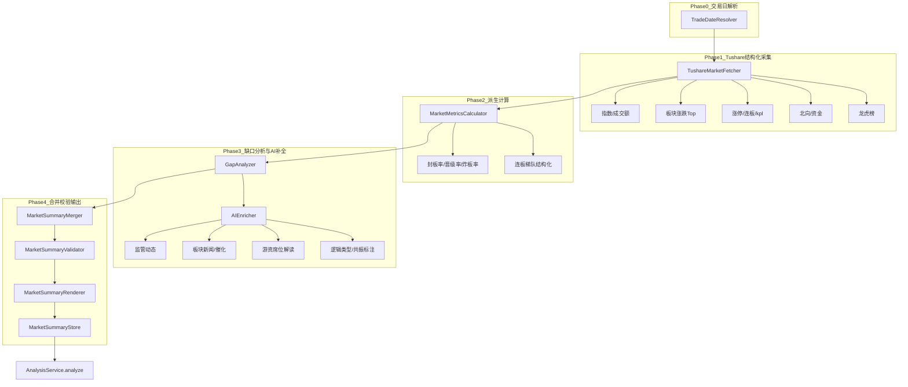

# 盘后数据（大盘数据）获取 — 初步设计

> ⚠️ **OBSOLETE — 此文档已被取代，仅作历史归档**
>
> 现状版请看：
> - [盘后数据自动化-功能说明.md](./盘后数据自动化-功能说明.md)（主人版）
> - [盘后数据自动化-施工方案.md](./盘后数据自动化-施工方案.md)（施工版）
> - [_tushare_field_audit.md](./_tushare_field_audit.md)（实测字段）
>
> 主要变更：
> - 文件存储 → 全部入 `data/market.db` 14 张表
> - 游资别名 JSON → 升级为 `dim_trader_alias` DB 表
> - prompt 外置 JSON → 升级为 `prompts/market_fetch/*.md`
> - GUI 嵌入 AI 分析页按钮 → 独立成"📊 盘后数据"页
>
> ---
>
> 记录时间: 2026-05-26  
> 状态: **初步设计（已被 V2 取代）**  
> 关联: [架构方案.md](./架构方案.md) · [CLI评估回测-Agent优化初步设计.md](./CLI评估回测-Agent优化初步设计.md)  
> 参考模板: [分析数据/模板/三位一体盘后数据_2月5日.md](../分析数据/模板/三位一体盘后数据_2月5日.md)  
> 参考样例: [分析数据/盘后总结/2月/2.12/1.md](../分析数据/盘后总结/2月/2.12/1.md)

---

## 1. 问题定义

### 1.1 三位一体分析的输入模型

新闻分析（尤其 `trinity_*` / `short_term` 模板）实际需要 **三个独立输入**：

| 输入 | 当前来源 | 问题 |
|------|----------|------|
| **① 分析提示词** | `config/ai_config.json` → `prompt_templates` | 已有，可 GUI 编辑 |
| **② 盘后数据（大盘数据）** | GUI `summary_input` 手工粘贴；或网页端豆包/DeepSeek 手动跑模板 | **未自动化**；质量不稳定 |
| **③ 新闻数据** | SQLite `raw_news`（curated） | 已有流水线 |

当前 `AnalysisService.analyze(market_summary=...)` 与 `AINewsAnalyzer.build_user_prompt()` 已支持 `{market_summary}` 占位符，但 **② 完全依赖人工**，导致：

- AI 分析时缺少封板率、晋级率、板块资金、连板梯队等硬数据 → **分析偏空、偏猜**
- 手工网页流程耗时长（模板 800+ 行），且输出大量 `{n/a}`（见 2.12 样例）
- 无法纳入 Agent 自动化流水线、`eval` 回测闭环

### 1.2 旧流程（手动网页 AI）的优劣

**流程**:

```
三位一体盘后数据模板.md  →  豆包/DeepSeek 网页版（联网搜索）  →  盘后总结.md  →  粘贴到 GUI  →  analyze
```

**优点**:

- 联网搜索可补：**监管问询、游资席位、板块新闻、消息反响、定性逻辑解读**
- 模板极详尽，覆盖情绪/资金/连板/龙虎榜全维度

**缺点**（2.12 样例已暴露）:

| 问题 | 表现 |
|------|------|
| 完整性差 | 大量 `{n/a}`：近5日涨幅、封单额、北向精确值、完整连板梯队 |
| 不可复现 | 同一交易日不同次搜索，数值可能不一致 |
| 无结构化 | 输出 Markdown  prose，难做自动校验 |
| 无版本追溯 | 不知用的哪版模板、哪次搜索 |
| 幻觉风险 | 联网 AI 可能编造涨停数、资金数值 |
| 无法批量 | 不能 `pipeline daily` 无人值守 |

### 1.3 设计目标

1. **自动化**：CLI / 定时任务可 `--auto-market` 生成盘后数据
2. **结构化优先**：内部用 JSON Schema，Markdown 只是渲染视图
3. **混合数据源**：Tushare 打底（确定性数值）+ AI 补缺（联网/解读类）
4. **可评估**：`eval market-summary` 对完整性、数值一致性、幻觉率打分
5. **可优化**：盘后数据获取 prompt 纳入 experiment 体系，Agent 可迭代
6. **与分析解耦**：盘后数据服务独立，分析/题材抽取/回测共用同一份 `MarketSummary`

---

## 2. 总体方案：Structured-First 混合管道

### 2.1 核心思路

> **不要**把 800 行模板整份扔给 AI 让它「从头搜」；  
> **应该** Tushare 先填 60～70% 结构化硬数据 → 计算派生指标 → AI **仅补缺口** → 校验合并 → 渲染 Markdown。



### 2.2 三种运行模式

| 模式 | 说明 | 适用场景 |
|------|------|----------|
| `tushare-only` | 仅结构化数据 + 派生计算 | 快速冒烟、离线、无 API 额度 |
| `hybrid`（**默认**） | Tushare + AI 补缺口 | 日常盘后分析 |
| `ai-full` | 旧模式等价：大 prompt + 联网 AI 生成全文 | 对比基线、eval 对照组 |

---

## 3. 数据字段分层（来自模板的拆解）

将 [三位一体盘后数据_2月5日.md](../分析数据/模板/三位一体盘后数据_2月5日.md) 的字段按 **获取方式** 分为四层：

### 3.1 L1 — Tushare 可直接获取（高置信）

| 模块 | 字段 | Tushare API（已有/可复用） |
|------|------|---------------------------|
| 交易日 | 目标交易日、前一交易日 | `trade_cal` |
| 指数 | 上证/深成/创业板/科创50 收盘、涨跌幅 | `index_daily` |
| 量能 | 两市成交额（指数 amount 汇总或 market API） | `index_daily` / `daily_info` |
| 板块涨跌 | 东财概念 Top20 涨跌幅、成交额 | `dc_index` + `dc_daily` |
| 板块5日 | 近5日累计涨幅 | `dc_daily` 滚动计算 |
| 涨停生态 | 涨停家数、连板列表 | `kpl_list` / `limit_list_d` |
| 北向 | 沪股通/深股通净流入 | `moneyflow_hsgt` |
| 龙虎榜 | 上榜个股买卖额 | `top_list` / `top_inst` |
| 个股行情 | 龙头涨跌幅、成交额、换手 | `daily` + `daily_basic` |

> 项目已有 [tools/export_tushare_theme_daily.py](../tools/export_tushare_theme_daily.py) 可复用 `call()` 封装与 `dc_index` 选型结论（见 [Tushare 对比报告](../doc/reports/05-23-2100-Tushare题材数据源对比.md)）。

### 3.2 L2 — Tushare + 本地计算（中置信）

| 字段 | 计算方式 |
|------|----------|
| **封板率** | 封板数 / (涨停数 + 炸板数)；炸板来自 `limit_list_d` 或 kpl 状态 |
| **晋级率** | 今日连板成功数 / 昨日连板股总数（需 T-1 `kpl_list`） |
| **炸板率** | 炸板数 / (涨停 + 炸板) |
| **连板梯队** | 按连板高度分组 `kpl_list` / `limit_step` |
| **昨日涨停今日表现** | T-1 涨停列表 join T 日 `daily.pct_chg` |
| **板块主力净流入** | `moneyflow_ind_dc`（东财板块资金流，若权限可用） |
| **大小盘对比** | 沪深300/中证500/1000/2000 指数涨跌幅 |
| **涨跌家数** | `daily` 全市场统计或专用 market API |

### 3.3 L3 — AI 补全（低结构化、需联网或推理）

| 字段 | 为何 AI | 输入 grounding |
|------|---------|----------------|
| 监管问询/异常波动公告 | 分散在交易所/公司公告 | Tushare 已有涨停股列表 → AI 搜「{code} 异常波动」 |
| 游资席位（陈小群等） | 需解读营业部别名 | Tushare `top_list` 原始席位 → AI 映射知名游资 |
| 板块新闻/政策催化 | 非行情 API | 涨幅 Top5 板块名 + 本地新闻库 `raw_news` 交叉 |
| 逻辑类型标注（1～6级） | 定性判断 | 结构化板块 + 新闻摘要 → AI 分类 |
| 消息首发后市场反响 | 需事件串联 | 新闻 + 板块 T 日涨幅 |
| 历史相似事件 | 检索型 | AI 搜索 + 可选本地历史库 |

### 3.4 L4 — 纯人工/暂不支持自动（标记 `{n/a}`）

| 字段 | 原因 |
|------|------|
| 实时封单额（盘中变化） | 收盘后难精确还原；可选第三方付费源 |
| 首板「全部」逐笔涨停时间 | 数据量大，Tushare 免费接口不全 |
| 完整特大单/大单分层（个股级） | 需 Level2 或付费数据源 |

**策略**: L4 字段在 `hybrid` 模式下降级为「可选」，不阻塞分析；`validator` 输出 `completeness_score` 告知下游。

---

## 4. 核心数据结构

### 4.1 `MarketSummary` JSON Schema（内部 canonical 格式）

盘后数据 **入库和 eval 一律用 JSON**；Markdown 仅用于 `analyze` 的 `{market_summary}` 注入。

```json
{
  "meta": {
    "trade_date": "2026-02-12",
    "prev_trade_date": "2026-02-11",
    "generated_at": "2026-02-12 17:30:00",
    "mode": "hybrid",
    "prompt_version": "market_fetch_v1.0",
    "sources": ["tushare", "ai_enricher", "raw_news_crossref"]
  },
  "overview": {
    "market_summary_one_line": "指数强个股弱，AI算力+电网+小金属为主线",
    "main_theme_one_line": "算力硬件/电网设备/小金属",
    "emotion_level": 5.5,
    "emotion_stage": "分歧"
  },
  "indices": {
    "sh": {"close": 4134.02, "pct_chg": 0.05, "amount_yi": 8980},
    "sz": {"close": 14283.0, "pct_chg": 0.86, "amount_yi": 12438},
    "cyb": {"close": 3328.06, "pct_chg": 1.32},
    "total_turnover_yi": 21400,
    "prev_turnover_yi": 19800
  },
  "breadth": {
    "advance": 2108,
    "decline": 3280,
    "limit_up": 69,
    "limit_down": 22,
    "failed_limit": 21
  },
  "sentiment": {
    "seal_rate": 0.767,
    "seal_rate_prev": 0.72,
    "promotion_rate": 0.455,
    "fail_rate": 0.233,
    "max_height": 4,
    "max_stock": "雅博股份",
    "max_sector": "电网设备"
  },
  "capital_flow": {
    "north_net_yi": 12.5,
    "main_net_yi": null,
    "consensus": "分歧"
  },
  "sectors_top": [
    {
      "rank": 1,
      "name": "小金属",
      "canonical_code": "BK0478",
      "pct_chg": 2.06,
      "pct_chg_5d": 18.5,
      "limit_up_count": 8,
      "main_net_yi": null,
      "leaders": [{"name": "翔鹭钨业", "code": "002842.SZ", "height": "5天3板"}],
      "logic_type": "产业周期拐点",
      "resonance_count": 3,
      "high_risk": "中危",
      "catalysts": [],
      "field_sources": {"pct_chg": "tushare", "catalysts": "ai_enricher"}
    }
  ],
  "limit_ladder": {
    "4": [{"name": "雅博股份", "code": "002323.SZ", "sector": "电网设备"}],
    "3": [],
    "2": [{"name": "章源钨业", "code": "002378.SZ", "sector": "小金属"}]
  },
  "dragon_tiger": {
    "stocks": [{"name": "英维克", "net_buy_yi": 1.2, "reason": "涨幅偏离"}],
    "famous_traders": [{"alias": "作手新一", "stock": "...", "side": "buy", "confidence": 0.7}]
  },
  "regulation": [
    {"target": "江钨装备", "type": "异常波动", "date": "2026-02-12", "severity": "中"}
  ],
  "gaps": [
    {"field": "capital_flow.main_net_yi", "reason": "tushare_permission", "filled_by": null},
    {"field": "sectors_top[0].main_net_yi", "reason": "api_unavailable", "filled_by": "ai_enricher"}
  ],
  "quality": {
    "completeness_score": 0.72,
    "numeric_field_rate": 0.85,
    "l1_complete": true,
    "l2_complete": true,
    "l3_complete": false
  }
}
```

### 4.2 存储

**文件路径**（与现有目录习惯一致）:

```
data/market_summary/
  2026-02-12/
    summary.json          # canonical
    summary.md            # 渲染给 analyze 用
    summary.meta.json     # 采集日志、API 调用记录
    enrich_patch.json     # AI 补全的 JSON patch（可追溯）
```

**SQLite 新表 `market_summaries`**（Phase 2，便于 analyze 关联回测）:

```sql
CREATE TABLE IF NOT EXISTS market_summaries (
    id              INTEGER PRIMARY KEY AUTOINCREMENT,
    trade_date      TEXT NOT NULL UNIQUE,
    mode            TEXT NOT NULL,
    summary_json    TEXT NOT NULL,
    summary_md_path TEXT NOT NULL,
    completeness    REAL,
    prompt_hash     TEXT,
    created_at      TEXT NOT NULL
);
```

**与分析报告关联**: `experiment_runs` / 分析报告元数据增加 `market_summary_id` 或 `trade_date` 外键。

---

## 5. 模块设计

### 5.1 目录结构

```
services/market/
├── __init__.py
├── market_summary_service.py    # 统一入口 build/fetch/get
├── trade_date_resolver.py       # 交易日解析
├── tushare_fetcher.py           # L1/L2 结构化采集（复用 export 脚本）
├── metrics_calculator.py        # 封板率/晋级率/梯队/5日涨幅
├── gap_analyzer.py              # 对比 checklist，输出 gaps[]
├── ai_enricher.py               # L3 AI 补全（JSON patch 模式）
├── merger.py                    # 合并 tushare + ai patch
├── validator.py                 # 数值范围/交叉校验/完整性评分
├── renderer.py                  # JSON → Markdown（compact/full 两种模板）
└── store.py                     # 文件 + SQLite 读写

config/
├── market_fetch_prompt.json     # AI 补全 prompt（可 eval 优化）
└── market_summary_schema.json   # JSON Schema 用于校验

eval/scorers/
└── market_summary_scorer.py     # 盘后数据质量评估
```

### 5.2 统一入口 `MarketSummaryService`

```python
class MarketSummaryService:
    def build(
        self,
        trade_date: str | None = None,   # None → 最近交易日
        mode: Literal["tushare-only", "hybrid", "ai-full"] = "hybrid",
        enrich_provider: str = "deepseek",
        render: Literal["compact", "full"] = "compact",
        progress_callback: Callable | None = None,
    ) -> MarketSummaryResult:
        """
        Returns:
            ok: bool
            trade_date: str
            summary_json: dict
            summary_md_path: str
            completeness: float
            gaps: list
            error: str | None
        """
```

**调用链**:

```
MarketSummaryService.build()
  → TradeDateResolver.resolve(trade_date)
  → TushareMarketFetcher.fetch(trade_date)           # → raw_structured
  → MarketMetricsCalculator.compute(raw_structured)  # → +sentiment/ladder/5d
  → GapAnalyzer.analyze(computed, checklist)         # → gaps[]
  → [if mode hybrid/ai-full] AIEnricher.enrich(gaps, computed)
  → MarketSummaryMerger.merge(computed, patches)
  → MarketSummaryValidator.validate(merged)          # → quality scores
  → MarketSummaryRenderer.render(merged, template=render)
  → MarketSummaryStore.save(json, md, meta)
```

### 5.3 `TushareMarketFetcher` — 采集清单

| 步骤 | API | 输出字段 |
|------|-----|----------|
| 1 | `trade_cal` | meta.trade_date, prev_trade_date |
| 2 | `index_daily` | indices.* |
| 3 | `daily` 聚合 | breadth.advance/decline（或替代 API） |
| 4 | `dc_index` + `dc_daily` | sectors_top（概念板块，idx_type=概念） |
| 5 | `kpl_list` / `limit_list_d` | breadth.limit_up, limit_ladder |
| 6 | T-1 kpl + T daily | sentiment.promotion_rate, 昨日涨停表现 |
| 7 | `moneyflow_hsgt` | capital_flow.north_net |
| 8 | `top_list` | dragon_tiger.stocks |
| 9 | `daily` + `daily_basic` | leaders 的 pct_chg, turnover |

**缓存**: `data/tushare_cache/{trade_date}/` 存原始 API 响应，同一天重复 build 不重复扣积分。

### 5.4 `AIEnricher` — 关键设计（与旧模板本质区别）

**旧方式（不推荐继续作为主路径）**:

```
800行模板 + "请搜索今日数据" → AI 输出整篇 Markdown
```

**新方式（推荐）**:

```
输入:
  1. 已填充的 MarketSummary JSON（Tushare 部分）
  2. gaps[] 清单（仅列缺失字段路径）
  3. 本地新闻 crossref：raw_news 中当日 curated 标题列表（可选）
  4. compact enrich prompt（~100行，见 config/market_fetch_prompt.json）

输出:
  JSON Patch 数组，而非自由 Markdown：
  [
    {"op": "replace", "path": "/sectors_top/0/catalysts", "value": [...]},
    {"op": "add", "path": "/regulation/-", "value": {...}},
    {"op": "replace", "path": "/dragon_tiger/famous_traders", "value": [...]}
  ]
```

**Enrich Prompt 要点**（外置到 `config/market_fetch_prompt.json`）:

- 明确：**不得修改已有 Tushare 数值字段**；冲突时新增 `conflicts[]` 而非覆盖
- 缺失填 `null`，禁止编造数值；定性字段（logic_type）可推理但须标注 `confidence`
- 监管类：**宁可漏报不可瞎编**；无依据则 `regulation: []`
- 优先使用提供的 `raw_news` 标题作新闻催化，而非凭空搜索

**模型选择**:

| 任务 | 模型 | 理由 |
|------|------|------|
| 数值已有、补定性 | `deepseek-v4-flash` | 便宜、快 |
| 需广泛联网（若接入搜索 API） | 网页 AI / 搜索增强模型 | 仅对 L3 gaps 子集调用 |

**与本地新闻库联动**（重要优化）:

```
AIEnricher.enrich()
  → RawStore.get_news_for_date(trade_date, status=curated)
  → 按 sectors_top[].name 关键词匹配新闻
  → 作为 catalysts 首选来源（比纯联网幻觉低）
```

### 5.5 `MarketSummaryRenderer` — 两种 Markdown 模板

分析 prompt 不需要 800 行全文；`build_user_prompt` 注入 `{market_summary}` 时应 **控 token**。

| 模板 | 篇幅 | 用途 |
|------|------|------|
| `compact`（**默认**） | ~150～300 行 | 注入 analyze：核心指数、情绪、Top10 板块、连板梯队摘要、北向、监管警示 |
| `full` | ~500+ 行 | 人工阅读、归档、与旧模板对照 |

**compact 必含字段**（对应分析模板 §1.1 核心数据确认表）:

- 交易日、成交额、涨跌家数、涨跌停
- 封板率、晋级率、最高板
- 北向/主力（有则填，无则显式 `N/A`）
- Top10 板块：名称、涨跌幅、5日涨幅、涨停数、龙头、逻辑类型、风险等级
- 连板梯队摘要（最高 4 板向下各层代表）
- 监管警示列表
- `completeness_score` 与 `gaps` 摘要（让分析 AI 知道哪些数据缺失）

### 5.6 `MarketSummaryValidator` — 校验规则

| 规则 | 说明 |
|------|------|
| 数值范围 | 涨跌幅 ∈ [-20, 20]（ST 除外）；封板率 ∈ [0, 1] |
| 交叉校验 | 涨停数 ≈ kpl_list 计数；指数涨跌与已知大盘方向一致 |
| 来源标记 | 每个 top-level 数值必有 `field_sources` 或默认 tushare |
| AI 冲突 | AI patch 与 tushare 数值冲突 → 拒绝 patch，写入 `conflicts` |
| 完整性 | 按 L1/L2/L3 checklist 计算 `completeness_score` |

---

## 6. 与分析流水线的集成

### 6.1 调用链（端到端）

```
cli pipeline daily --auto-market
  → MarketSummaryService.build()           # ② 盘后数据
  → analyze_news(
        market_summary=store.get_md(date),
        source="curated",
        hours=24,
        template_id="trinity_resonance",
    )                                      # ① 提示词 + ③ 新闻
  → ThemeExtractor...
```

### 6.2 `AnalysisService` 改动（最小）

```python
def analyze(..., auto_market: bool = False, trade_date: str | None = None):
    if auto_market and not market_summary:
        ms = MarketSummaryService().build(trade_date=trade_date)
        market_summary = ms.summary_md if ms.ok else ""
```

### 6.3 GUI 改动（可选）

`ai_analysis_page.py`:

- 「盘后总结」输入框旁增加 **「自动获取」** 按钮 → 调 `MarketSummaryService.build()` 填入 `summary_input`
- 显示 `completeness_score` 徽章（绿/黄/红）

### 6.4 Prompt Cache 友好性

现有 `build_user_prompt` 策略：静态模板前缀 + 动态 `{market_summary}` + `{news_data}` 后置。

盘后数据获取后，**同一交易日多次 analyze** 时 `{market_summary}` 不变 → 有利于 prompt cache。  
`market_summary` 应保持稳定排序（板块按 rank），避免 AI enrich 每次输出顺序不同。

---

## 7. CLI 命令扩展

在 [CLI评估回测-Agent优化初步设计.md](./CLI评估回测-Agent优化初步设计.md) 基础上新增：

```bash
# 获取盘后数据
python cli.py market fetch [--date 20260212] [--mode hybrid] [--render compact] --json

# 查看已缓存
python cli.py market show --date 20260212 [--format json|md]

# 校验质量
python cli.py market validate --date 20260212 --json

# 与分析联调
python cli.py analyze --auto-market --template trinity_resonance --hours 24 --json

# 评估盘后数据质量
python cli.py eval market --cases eval/datasets/market_summary_cases.jsonl --json
```

---

## 8. Eval 与 Prompt 自动优化

### 8.1 盘后数据 Eval 指标

| 指标 | 计算 | 目标 |
|------|------|------|
| `completeness_score` | L1～L3 必填字段填充率 | ≥ 0.75 |
| `numeric_field_rate` | 数值型字段非 null 比例 | ≥ 0.85 |
| `tushare_consistency` | 与 Tushare 原始值一致率 | = 1.0（硬约束） |
| `hallucination_rate` | 人工/规则判定编造字段占比 | ≤ 0.05 |
| `cross_day_stability` | 同一 date 重复 fetch 核心指标方差 | ≈ 0 |
| `analyze_downstream_score` | 用该 summary 跑 analyze eval 的总分 | 间接指标 |

### 8.2 黄金样本

| 来源 | 用途 |
|------|------|
| [2.12/1.md](../分析数据/盘后总结/2月/2.12/1.md) 等历史手动产出 | 对照「人期望的叙述风格」 |
| 主人人工修正版（待整理） | `gold_summary.json` |
| Tushare 原始响应 | 数值真值 |

`eval/datasets/market_summary_cases.jsonl`:

```json
{
  "case_id": "market_20260212",
  "trade_date": "2026-02-12",
  "gold_json_path": "eval/datasets/gold/market_20260212.json",
  "gold_md_path": "分析数据/盘后总结/2月/2.12/1.md",
  "required_fields": ["sentiment.seal_rate", "indices.total_turnover_yi", "sectors_top[0].pct_chg_5d"]
}
```

### 8.3 两套 Prompt 的优化边界

| Prompt | 优化对象 | Eval 命令 |
|--------|----------|-----------|
| **盘后数据获取 prompt** | `config/market_fetch_prompt.json` | `eval market` |
| **新闻分析 prompt** | `config/ai_config.json` → `prompt_templates` | `eval analyze` |

**Agent 闭环**:

```
1. eval market --prompt-version v1.0  → completeness=0.68
2. Agent 改 market_fetch_prompt.json
3. eval market --prompt-version v1.1  → completeness=0.76 ↑
4. experiment promote
5. eval analyze（用新 summary + 原分析模板）→ 下游分数是否提升
```

**注意**: 分析 prompt 优化和盘后 prompt 优化 **分开实验**，避免同时改两个变量。

### 8.4 与回测的衔接

```
MarketSummary(sectors_top) + theme_predictions  →  验证「分析时看到的主线」与「事后 T+1 板块涨跌」是否一致
```

回测时可对比：

- 盘后数据 Top5 板块 T+1 收益
- 分析报告优先级 Top5 vs 实际涨幅排名 Spearman 相关

---

## 9. 方案对比

| 方案 | 完整性 | 准确性 | 成本 | 自动化 | 推荐 |
|------|--------|--------|------|--------|------|
| A. 纯手动网页 AI（现状） | 中（多 n/a） | 中（幻觉） | 低钱高时间 | ❌ | 作对照基线 |
| B. 纯 Tushare 脚本 | 中低 | 高 | 低 | ✅ | `tushare-only` 模式 |
| C. **Tushare + AI 补缺口（本设计）** | 高 | 高 | 中 | ✅ | **默认** |
| D. 纯 AI 大模板 | 中 | 低 | 高 | ✅ | 仅 `ai-full` 对照 |

---

## 10. 实施计划

### Phase M1 — 结构化采集（3～4 天）

| 任务 | 产出 |
|------|------|
| 抽取 `TushareMarketFetcher`（从 export 脚本 refactor） | L1 指数/板块/涨停 |
| `MarketMetricsCalculator` | 封板率/晋级率/梯队 |
| `MarketSummary` JSON + 文件存储 | `data/market_summary/` |
| `renderer compact` | 可注入 analyze 的 Markdown |
| `cli market fetch --mode tushare-only` | 首批可用 |

**验收**: 对 20260522 已有 Tushare 缓存日，`fetch` 产出 JSON + compact md；核心指数/板块与 export 脚本一致。

### Phase M2 — AI 补全 + 校验（3～4 天）

| 任务 | 产出 |
|------|------|
| `config/market_fetch_prompt.json` | 外置 enrich prompt |
| `AIEnricher` JSON patch 模式 | L3 补全 |
| `GapAnalyzer` + `Validator` | 完整性评分 |
| raw_news crossref | 板块催化来自本地新闻 |
| `cli market fetch --mode hybrid` | 默认模式 |

**验收**: 2.12 类型交易日，`completeness_score` ≥ 0.7；无 Tushare 数值被 AI 覆盖。

### Phase M3 — 集成 + Eval（2～3 天）

| 任务 | 产出 |
|------|------|
| `analyze --auto-market` | 流水线打通 |
| `eval market` + 5 条 gold cases | 可量化 |
| GUI「自动获取」按钮 | 可选 |
| `market_summaries` SQLite 表 | 可追溯 |

### Phase M4 — 增强（后续）

- 龙虎榜游资别名库（`config/trader_seat_aliases.json`）减少 AI 依赖
- 接入搜索 API（若需）仅对 `regulation` / `historical_events` gaps
- 封单数据第三方源评估

---

## 11. 风险与对策

| 风险 | 对策 |
|------|------|
| Tushare 积分/权限不足 | 缓存 + 降级 `tushare-only`；缺失字段进 gaps |
| AI 编造北向/封板率 | Validator 拒绝覆盖 L1/L2 数值；仅允许 L3 定性字段 |
| 800 行旧模板惯性 | compact 渲染足够分析；full 仅归档 |
| 与分析 prompt 耦合 | `{market_summary}` 格式版本号；renderer 变更走 eval |
| 本地新闻库不全 | enrich 时标注 catalyst 来源；无则留空 |

---

## 12. 待主人确认

- [ ] **默认 render 模板**: `compact` 是否够用（推荐是；full 可选）
- [ ] **AI 补全范围**: 是否允许 AI 调联网搜索，还是仅基于 Tushare + raw_news（推荐后者优先）
- [ ] **完整性阈值**: `completeness_score < 0.6` 时是否 **阻断 analyze**（推荐：警告但允许，分析 prompt 已要求标注「依据不足」）
- [ ] **历史手动盘后总结**: 是否纳入 gold set（建议：选 5～10 份人工修正版）
- [ ] **定时任务**: `pipeline daily` 是否在 crawl+clean 后 **自动 market fetch**（推荐是）

---

## 13. 关键调用链速查

```
# 盘后数据独立获取
cli market fetch
  → MarketSummaryService.build
      → TushareMarketFetcher.fetch
      → MarketMetricsCalculator.compute
      → GapAnalyzer.analyze
      → AIEnricher.enrich (hybrid)
      → Merger → Validator → Renderer → Store

# 三位一体分析（三输入齐备）
cli analyze --auto-market
  → MarketSummaryService.build (或 Store.get)
  → analyze_news(market_summary=md, news from SQLite)
      → AINewsAnalyzer.build_user_prompt(market_summary, news_data)
      → LLM 分析
      → ThemeExtractor (optional)

# 质量迭代
cli eval market
  → EvalRunner.run_market_eval
      → MarketSummaryService.build (per case)
      → MarketSummaryScorer.score(vs gold)
      → ExperimentStore.save_run
```

---

## 14. 一句话总结

**盘后数据不要继续「800 行模板扔网页 AI」；改为 Tushare 结构化打底 + AI 只补缺口 + JSON 校验 + compact Markdown 注入分析。** 这样完整性、准确性、自动化、可 eval 四者兼得，且与分析/回测/Agent 优化体系自然衔接。

---

*审阅通过后，Phase M1 与 CLI Phase 0 可并行启动。*
