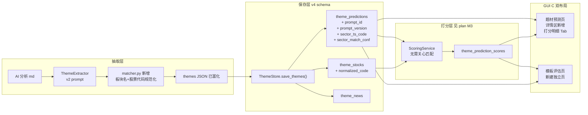
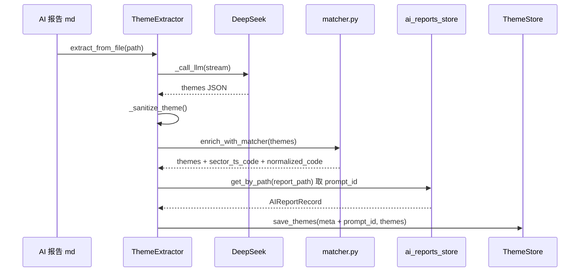

# 题材抽取保存与 GUI 补全设计（与 v4 schema 一次升级）

> 时间：2026-05-27 10:03  
> 起因：主人指出"除打分逻辑外，抽取/保存/题材 GUI/打分 GUI 都没拍板"。本文档把 4 块全部补齐，并把上次 [v3 带符号化](../updates/05-27-0949-题材强度评分带符号化.md) 的改动合并成**一次 v4 升级**落地。  
> 主人决策：B 推荐集（保存层 schema 扩展全开）+ C 双布局（GUI 形态）。  
> 状态：辉夜按 [施工文档](../../.huiye/_施工_抽取保存GUI补全.md) 实施。

---

## 一、总体架构（含本次 + 上次决策的合并视图）



---

## 二、12 个决策点的最终结论表

| 编号 | 决策项 | 结论 | 备注 |
|------|--------|------|------|
| A1 | `stock.code` 必填? | **保持可选** | 不强制 AI，下游 normalize 兜底 |
| A2 | AI 给 sector_ts_code? | **No** | **实测 DeepSeek V4 Pro 准确率仅 7.4%（2/27）**，详见 [tools/test_ai_sector_code_accuracy.py](../../tools/test_ai_sector_code_accuracy.py) |
| A3 | 新增 prediction_window? | **No 一期不加** | 统一 5 交易日窗口 |
| A4 | prompt v2 老数据? | **清空** | 走 v4 schema 指纹 DROP 重建 |
| **B1** | 冗余 prompt_id / prompt_version 到 theme_predictions? | **Yes** | 主人决策 B 推荐集 |
| **B2** | theme_stocks 加 normalized_code? | **Yes** | 主人决策 B 推荐集，原 code 保留审计 |
| **B3** | theme_predictions 落 sector_ts_code + sector_match_conf? | **Yes** | 主人决策 B 推荐集，避免打分时重算 |
| B4 | 打分状态机用 score_status 字段? | **No** | 用 theme_prediction_scores 有无记录推导 |
| C1 | 主表加打分列? | **加 1 列：综合脚本分** | 详情其他维度进 Tab |
| C2 | 详情 Tab 加打分明细 Tab? | **Yes** | 5 天涨跌曲线 + 标的逐只 + AI 点评 |
| C3 | 题材热度演化折线? | **二期再做** | |
| C4 | 上半区加模板筛选下拉? | **Yes** | 一行代码 |
| **D1** | GUI 形态? | **C 双布局** | 主人决策 |
| D2 | 模板对比视图? | **a 大表格 + b 折线图** | c 雷达图二期 |
| D3 | 时间筛选? | **7 / 30 / 任意区间** | |
| D4 | 重打分按钮? | **Yes** | GUI 必须有 |

---

## 三、抽取层设计（含 matcher 前置）

### 流程改造



### 新加的两步

**1. matcher 富化（新文件 [services/scoring/matcher.py](../../services/scoring/matcher.py)）**

抽取流程的末尾新增 `enrich_with_matcher(themes)` 步骤，**在入库前**就把：
- 每个 theme 的 `theme_name` → `(sector_ts_code, sector_match_conf)` 落到题材对象
- 每个 stock 的 `code` / `name` → `normalized_code` 落到 stock 对象

好处：**打分服务不用再管模糊匹配**，纯做数学计算；调试 / 回测时数据完整可追溯。

**2. prompt_id 反查（复用现有接口）**

`save_themes` 入参 `report_meta` 自动从 `ai_reports_store.get_by_path(report_path)` 反查 `prompt_id` + `prompt_version` 写入 `theme_predictions`。

如果反查失败（手动导入的旧报告、ai_reports 表无记录），prompt_id=NULL，**不影响**核心流程，仅打分聚合时该题材归入"未知模板"。

### Prompt 模板小改

[prompts/theme_extraction/extract_themes.md](../../prompts/theme_extraction/extract_themes.md) 在 v3 改动（删 sentiment + score 范围）基础上：

- 不要求 AI 给 `sector_ts_code`（避免 AI 编代码）
- 不要求 AI 给 `prediction_window`（一期统一窗口）
- `stock.code` 保持可选（matcher 兜底）

---

## 四、保存层设计（v4 schema）

### 表结构变化（叠加 v3 + v4）

```sql
CREATE TABLE theme_predictions (
    -- v3 已确定（删 sentiment + score 范围扩展）
    id                INTEGER PRIMARY KEY AUTOINCREMENT,
    report_id         TEXT NOT NULL,
    report_date       TEXT NOT NULL,
    report_time       TEXT,
    report_path       TEXT NOT NULL,
    theme_name        TEXT NOT NULL,
    theme_category    TEXT,
    strength_score    INTEGER NOT NULL,        -- -100 ~ +100
    strength_level    TEXT NOT NULL,           -- 9 档枚举
    priority_rank     INTEGER,
    duration          TEXT,
    expectation_gap   TEXT,
    is_cold           INTEGER NOT NULL DEFAULT 0,
    reason            TEXT NOT NULL,
    risk_note         TEXT,
    -- v4 本次新增（B1 + B3）
    prompt_id         TEXT,                    -- 冗余 ai_reports.prompt_id
    prompt_version    TEXT,                    -- 冗余 ai_reports.prompt_version
    sector_ts_code    TEXT,                    -- 板块匹配结果如 BK0917.DC
    sector_match_conf REAL,                    -- 匹配置信度 0~1
    created_at        TEXT NOT NULL
);
CREATE INDEX idx_theme_prompt_date  ON theme_predictions(prompt_id, report_date);
CREATE INDEX idx_theme_sector_date  ON theme_predictions(sector_ts_code, report_date);

CREATE TABLE theme_stocks (
    id              INTEGER PRIMARY KEY AUTOINCREMENT,
    theme_id        INTEGER NOT NULL,
    stock_name      TEXT NOT NULL,
    stock_code      TEXT,                      -- AI 原始输入，保留审计
    -- v4 本次新增（B2）
    normalized_code TEXT,                      -- NNNNNN.{SH|SZ|BJ}，下游打分用
    role            TEXT,
    reason          TEXT,
    FOREIGN KEY (theme_id) REFERENCES theme_predictions(id) ON DELETE CASCADE
);
CREATE INDEX idx_theme_stocks_normcode ON theme_stocks(normalized_code);

-- theme_news 不变
```

### 数据流改造

[services/storage/theme_store.py](../../services/storage/theme_store.py)::`save_themes` 新增两步：

1. **反查 prompt_id**：`ai_reports_store.get_by_path(report_path)` → `(prompt_id, prompt_version)`，找不到则两值 NULL
2. **写新列**：INSERT 时填入 prompt_id / prompt_version / sector_ts_code / sector_match_conf；INSERT theme_stocks 时填入 normalized_code

---

## 五、题材显示 GUI 设计

### 列变化（[theme_prediction_page.py](../../gui/pages/theme_prediction_page.py) `_THEME_TABLE_COLS`）

| 旧 v3 | 新 v4 | 改动 |
|-------|-------|------|
| 时间 | 时间 | 保留 |
| 题材 | 题材 | 保留 |
| 等级 | 等级 | 保留（值变 9 档） |
| 分数 | 分数 | **加正负色标** |
| ~~情绪~~ | — | **删** |
| 冷处理 | 冷处理 | 保留 |
| 持续性 | 持续性 | 保留 |
| 预期差 | 预期差 | 保留 |
| 排名 | 排名 | 保留 |
| 核心逻辑 | 核心逻辑 | 保留 |
| — | **综合脚本分** | **新加（C1）** |
| — | **模板**（小字显示 prompt_id） | **新加（看模板对比用）** |

最终：10 列 → 11 列（删 1 加 2）。

### 详情区 Tab（新增第 4 个）

现有 Tab：📝 逻辑/原因 / 💼 关联标的 / 📰 关联新闻

**新增：📈 打分明细**

```
┌─ 📈 打分明细 ─────────────────────────────┐
│  5 天涨跌曲线（QChart / 简化柱状图都行）   │
│  ┌─────────────────────────────────┐    │
│  │  题材综合 vs 板块 vs 标的均 vs 基准 │    │
│  └─────────────────────────────────┘    │
│                                          │
│  标的逐只表格                            │
│  ┌────┬────┬────┬────┬────┬────┐       │
│  │标的│代码│D+1 │D+2 │D+3 │D+5 │       │
│  └────┴────┴────┴────┴────┴────┘       │
│                                          │
│  AI D+5 点评（折叠 expand）              │
└─────────────────────────────────────────┘
```

### 抽取区新增控件（C4）

下半区"日期下拉"右侧新增"模板筛选"下拉：
- 默认"全部模板"
- 可选已抽取过题材的所有 prompt_id（去重后展示）
- 选中后查询自动加 `WHERE prompt_id = ?`

---

## 六、打分显示 GUI 设计（新建独立页）

### 新建页面 [gui/pages/prompt_eval_page.py](../../gui/pages/prompt_eval_page.py)

注册到 [gui/main_window.py](../../gui/main_window.py)：

```python
# 第 89 行附近，theme_prediction 后插入：
'prompt_eval': PromptEvalPage(),

# 第 133 行附近，nav_items 加：
('prompt_eval', '📈 模板评估'),
```

### 页面布局

```
┌─ 📈 模板评估 ─────────────────────────────────────────┐
│  控制条                                                │
│  [时间: 最近 7 天 ▼]  [模板: 全选 ▼]  [指标: 综合分 ▼] │
│                                                       │
│  ┌─ 左：大表格 ─────────┐ ┌─ 右：折线图 ────────────┐ │
│  │ 模板 │样本│T+1│T+5│Alpha│ │  纵轴 = 选中指标       │ │
│  │ ──── │──  │──  │── │──  │ │  横轴 = 报告日期       │ │
│  │ ...  │... │... │...│... │ │  每个模板一条线        │ │
│  └─────────────────────┘ └─────────────────────────┘ │
│                                                       │
│  底部                                                 │
│  [🔄 重打分(选中模板+时间范围)] [📤 导出 CSV]          │
└──────────────────────────────────────────────────────┘
```

### 指标定义（继承自 [打分系统 plan](../../c:/Users/Administrator/.cursor/plans/题材预测回测打分系统_4793fb21.plan.md) M3.2）

| 指标 | 含义 | 公式 |
|------|------|------|
| 样本数 | 该模板下符合时间区间的报告数 | count(distinct report_id) |
| T+1 平均涨幅 | 题材综合涨跌 | mean(theme_pct_combined where day_offset=1) |
| T+5 平均涨幅 | 同上 day_offset=5 | mean(...) |
| Alpha | 超额收益 | T+N 涨幅 - 基准涨幅 |
| 命中率 | 题材方向正确占比 | count(theme_directional > 0) / count(theme) |
| 胜率 | 题材跑赢基准占比 | count(theme_alpha > 0) / count(theme) |
| 稳定性 | 模板日分标准差 | stdev(template_daily) |

---

## 七、关键依赖（已确认存在）

| 依赖 | 来源 | 状态 |
|------|------|------|
| `ai_reports_store.get_by_path(path)` | [services/storage/ai_reports_store.py:163](../../services/storage/ai_reports_store.py) | 已有 |
| 主导航注册接口 | [gui/main_window.py:83 + 125](../../gui/main_window.py) | 直接加 2 行 |
| `ThemeExtractor.extract_from_file` | [core/theme_extractor.py:81](../../core/theme_extractor.py) | 现有，加 enrich 步骤 |
| `_THEME_V3_COLUMNS` 指纹机制 | [services/storage/database.py:175-200](../../services/storage/database.py) | 改成 v4 触发 DROP |

---

## 八、与上次 v3 文档的合并说明

**重点**：上次 [v3 文档](../updates/05-27-0949-题材强度评分带符号化.md) 与本文档**合并成一次 v4 升级**施工，理由：

1. 反正都要 DROP theme_* 三表，一次到位避免触发两次 DROP
2. v3 改动尚未动手，本次直接覆盖
3. v4 schema 同时满足 v3（删 sentiment / score 改 -100~+100）与 v4（B1+B2+B3）

施工方式：辉夜在 [_施工_抽取保存GUI补全.md](../../.huiye/_施工_抽取保存GUI补全.md) 内统一管理 v4 升级，旧的 [_施工_题材强度带符号化.md](../../.huiye/_施工_题材强度带符号化.md) 在完工后删除。

---

## 九、验收 checklist

### 抽取 / 保存层

- [ ] [prompts/theme_extraction/extract_themes.md](../../prompts/theme_extraction/extract_themes.md) v2.0 上线，schema 描述清楚 strength_score -100~+100 / 删 sentiment / stock.code 可选
- [ ] [services/scoring/matcher.py](../../services/scoring/matcher.py) 新建，normalize_stock_code 单测覆盖 SH/SZ/BJ 三档
- [ ] [core/theme_extractor.py](../../core/theme_extractor.py) 抽取完自动调 matcher 富化
- [ ] [services/storage/theme_store.py](../../services/storage/theme_store.py) `save_themes` 反查 prompt_id 写入 4 个新列
- [ ] [services/storage/database.py](../../services/storage/database.py) `_THEME_V4_COLUMNS` 触发 DROP 重建，theme_* 三表为空且新列存在
- [ ] 用 5/26 两份 AI 报告重抽，确认入库的 theme_predictions 含 prompt_id 列、theme_stocks 含 normalized_code 列

### 题材 GUI

- [ ] 题材表删 "情绪" 列；分数列正负色标
- [ ] 新增 "综合脚本分" 列（打分系统未上线时显示 "—"）
- [ ] 新增 "模板" 小字列
- [ ] 详情区新增 "📈 打分明细" Tab（打分系统未上线时显示 placeholder "打分系统暂未运行，请见 plan M3"）
- [ ] 下半区控制条加 "模板筛选" 下拉

### 打分 GUI

- [ ] [gui/pages/prompt_eval_page.py](../../gui/pages/prompt_eval_page.py) 新建
- [ ] 主导航栏 "📈 模板评估" 入口
- [ ] 大表格 + 折线图布局
- [ ] 重打分按钮 + 导出 CSV 按钮（按钮可见但打分系统未上线前禁用 + tooltip 提示）

### 文档收尾

- [ ] 上一份 [.huiye/_施工_题材强度带符号化.md](../../.huiye/_施工_题材强度带符号化.md) 删除（合并到 v4 施工文档）
- [ ] 更新 [.huiye/README.md](../../.huiye/README.md) 索引

---

## 十、Review 阶段补充：已识别的设计遗漏

> 2026-05-27 10:18 主人要求二次 review，辉夜发现以下问题，已同步到施工文档。

### 严重级（必修）

**1. 路径不一致导致 prompt_id 反查永远失败**

- [ai_reports.file_path](../../services/storage/ai_reports_store.py) 存的是 `_to_relative_posix` 规范化后的**相对 posix** 路径（如 `data/AI_analysis/5月27日/x.md`）
- [theme_predictions.report_path](../../core/theme_extractor.py) 由 `parse_report_meta()` 第 684 行 `os.path.abspath(report_path)` 产生，是**绝对 Windows 路径**（如 `F:\NewsTrading\data\AI_analysis\5月27日\x.md`）
- 直接 `get_by_path(theme.report_path)` 永远 0 命中

**修复**：保存层反查 prompt_id 前，调用 `_to_relative_posix` 把 report_path 规范化。同时 [parse_report_meta](../../core/theme_extractor.py) 改为也存相对 posix 路径，统一约定。

> **主人 2026-05-27 10:25 拍板**：采用"统一规范化"方案（而非改走 report_id 强 FK join），保留 `report_path` 字段、所有写入处统一走 `_to_relative_posix`。改动面小、回滚容易，且后续若想升级到 FK 也不冲突。

**2. 重复入库无防护**

- 现有 [save_themes](../../services/storage/theme_store.py) 只 INSERT 不去重
- 同一份 md 抽两次（手动 + 自动 / 重抽测试 / 调度并发）→ 同题材在 `theme_predictions` 出现多条
- 打分聚合时**双倍计入**，模板得分严重失真

**修复**：`save_themes` 入口先 `delete_by_report(report_id)`，事务内 DELETE + INSERT 保证幂等。

### 中等级（必修）

**3. theme_prediction_scores 缺 FK + ON DELETE CASCADE**

- 打分系统 plan M3.1 表设计漏了外键
- 主人手动从 GUI "删除当前报告题材" 后，孤儿打分记录残留

**修复**：theme_prediction_scores.theme_id 加 `FOREIGN KEY ... ON DELETE CASCADE`，theme_stock_scores 同理。

**4. prompt 版本聚合断层**

- 同一 `prompt_id` 升级 v1→v2 后，旧数据继续聚合会污染评估
- 例：scalper@1.0 跑 5 天 + scalper@2.0 跑 3 天，简单聚合 8 个样本会掩盖 v2 的改进

**修复**：模板评估页查询时 `GROUP BY (prompt_id, prompt_version)`，UI 显示 "scalper@1.0" 与 "scalper@2.0" 分行；提供"忽略版本"开关。

**5. 模板筛选下拉应显示友好 name 而非 prompt_id**

- 主人看到 "speculator_scalper" 不如看到 "A股短线投机·实战派" 直观
- 所有 prompts/*.md 的 frontmatter 都有 `name` 字段（已确认 13/13 覆盖），可直接用 `PromptLoader.get(...).name`

**修复**：模板筛选下拉、模板评估页表格的"模板"列都通过 PromptLoader 翻译 prompt_id 为 friendly name；下拉的 data 仍存 prompt_id。

**6. ThemeStore 缺组合筛选接口**

- 现有 `get_by_date()` / `get_by_report()` 各管一维
- 模板筛选 + 日期筛选组合查询要新增

**修复**：新增 `ThemeStore.get_by_date(report_date, prompt_id=None)`（追加可选参数），同时新增 `list_distinct_prompts()` 取所有已抽过题材的模板列表（去重）。

### 轻微级（一期标注，二期可补）

**7. 折线图实现方式**：推荐 PyQtChart（已是 PyQt5 配套，无需新依赖），二期可换 pyecharts 嵌入 QWebEngineView。

**8. 冷启动模板样本量警告**：表格中样本数 < 5 的单元格变橙色（提示统计意义不足）；一期实现，简单 ifelse。

**9. AI D+5 评分去重**：同题材跨报告（如 scalper 早盘报告 + 晚盘报告都抽到"先进封装"），AI 评估按 `(theme_name, report_date)` 去重，避免重复 LLM 调用。

**10. 重打分按钮范围**：UI 上的"重打分"按钮加确认弹窗 + 范围选择（当前筛选条件 / 全部）；一期默认"当前筛选条件"。

**11. services.market.db_helper 路径分层问题**：施工文档 §2.1 已明确，把 `get_market_db` 上提到 `services/market/db.py`，gui 改 re-export。

### 不修（已确认不是问题）

- AI 抽取后 `sentiment` 字段残留：校验阶段 drop 即可
- 历史报告题材的兼容：已决策清空，无问题
- Tushare daily 接口免费额度：主人 Tushare 有 5000+ 积分（看 plan M1 引用），单日 5400 行 + 30 天回填 = 16 万行，单日调用次数限制内可控

---

## 十·B、第二轮 Review 补充（10:43 深入代码层后追加）

> 第一轮 review 是从设计文档自洽性出发；这一轮深入到 [core/theme_extractor.py](../../core/theme_extractor.py) / [services/analysis_service.py](../../services/analysis_service.py) / [services/storage/database.py](../../services/storage/database.py) / [core/scheduler_service.py](../../core/scheduler_service.py) 验证假设，又找到 10 项。

### 🔴 严重级（必修）

**N1：`report_id` 概念冲突（重大！文档误导）**

代码层实测：

| 出处 | report_id 是什么 | 类型 |
|------|-----------------|------|
| [parse_report_meta()](../../core/theme_extractor.py) Line 686 | **文件名 string**（去掉 `.md`）<br/>如 `5月22日_18时25分_盘后总结分析报告` | TEXT |
| [theme_predictions.report_id](../../services/storage/database.py) Line 36 | 上面那个 string | `TEXT NOT NULL` |
| [ai_reports.id](../../services/storage/database.py) | 数据库自增主键 | `INTEGER PRIMARY KEY AUTOINCREMENT` |
| [record_report() 返回值](../../services/storage/ai_reports_store.py) | 自增 INTEGER | INTEGER |

**两个 `report_id` 根本不是同一个东西，无法 join！**  

→ 反查 prompt_id **必须**走 `report_path`（这倒和 P1 修复一致）。  
→ 通读版 §五 Q4 我之前说"如果想升级到 FK 也不冲突"——**错的！**真要升级 FK 必须先把 `theme_predictions.report_id` 从 `TEXT(文件名)` 改成 `INTEGER(指向ai_reports.id)`，是大 schema 变更。

**修复**：
1. 通读版 Q4 措辞要订正（已修正）
2. 两份文档加显著提示「两个 report_id 不同！」
3. 长期愿景：未来想真上 FK 时，需要单独立项做 schema migration（不在本次范围）

**N2：定时调度系统已存在，新增 4 个任务类型未规划**

实测发现 [core/scheduler_service.py](../../core/scheduler_service.py) + [services/scheduled_runner.py](../../services/scheduled_runner.py) 已经支持任务类型：

```
crawl_sync / clean_sync / analyze / market_fetch
```

打分系统需要新增的任务类型：

| 任务类型 | 触发时机 | 干啥 |
|---------|---------|------|
| `stock_daily_sync` | 每日 17:00 | 拉全 A 股个股当日涨跌入库 |
| `sector_daily_sync` | 每日 17:00 | 拉全板块当日涨跌入库 |
| `theme_score_daily` | 每日 17:30 | 给追踪期内题材打脚本分 |
| `theme_ai_review` | 每日 17:35 | 扫今日 D+5 题材交 AI 复审 |

**修复**：施工文档需新增 Step 13：
1. 在 [services/scheduled_runner.py Line 109](../../services/scheduled_runner.py) 后追加 4 个 `if task_type == "xxx"` 分支
2. 在 [gui/pages/schedule_page.py:TASK_TYPE_LABELS Line 20-25](../../gui/pages/schedule_page.py) 加 4 个中文标签
3. 在 [data/schedule_tasks.json](../../data/schedule_tasks.json) 加 4 条默认任务（建议默认 enabled=false，主人手动开）

### 🟠 中等级（必修）

**N3：AI 评分员 prompt 模板未设计**

通读版 §阶段六只说"调 AI 评分员"，但模板放哪、什么格式都没写。

**修复**：
- 新建目录 `prompts/theme_review/`
- 新建文件 `prompts/theme_review/theme_d5_review.md`，frontmatter 标准格式
- 输入 schema：
  ```
  {
    "题材": {题材预测原文},
    "实际表现": [
      {"日期": "...", "板块涨幅": ..., "标的涨幅列表": [...], "命中数": ...},
      ... 5 天
    ],
    "大盘对比": [{"日期": "...", "上证涨幅": ...}, ...]
  }
  ```
- 输出 schema：
  ```
  {
    "quality_label": "事前能看出" | "运气好/差" | "明显错误",
    "comment": "≤200字评语",
    "lessons_learned": "对模板优化的建议（可空）"
  }
  ```
- 在 plan M3.3 引用本模板

**N4：AI 评分员的成本预估缺失**

按经验值估：
- 30 天 × 平均 2 模板 × 平均 4 题材 × 1 次 AI 评分 = **240 次 LLM 调用/30 天 ≈ 8 次/天**
- 单次 ~1500 tokens（题材 800 + 5 天数据 700）
- DeepSeek V4 Pro：~$0.01/次 → **30 天 ~$2.4**
- GPT-4 Turbo：~$0.05/次 → 30 天 ~$12
- Claude Sonnet：~$0.03/次 → 30 天 ~$7

**修复**：通读版的 FAQ 段加一条"AI 评分员每月大概多少钱"，主人有数。

**N5：matcher 的标的代码标准化未利用 dim_stock**

通读版 §阶段二只说"沪市规则 6→.SH"。但主人 2026-05-26 23:10 已经把 5522 只 `dim_stock` 入库，可以做**精确匹配**（更稳）。直接套规则容易踩"688（科创板）/300（创业板）/8（北交所）/4（北交所）"细节坑。

**修复**：matcher 标的代码标准化优先级：
1. **dim_stock 精确匹配**（按 6 位代码反查带后缀的 ts_code）
2. **后缀规则兜底**（6→.SH / 0/3→.SZ / 8/4→.BJ）
3. **标记需人工**（既查不到也不匹配规则）

**N6：「重打分」按钮的语义未澄清**

主人改了打分阈值（如 3% → 5%）想回测时，需要重打分。但：

- **脚本分**：重算便宜，可以全量重跑
- **AI 评语**：重算昂贵，且本身有随机性（同一份预测两次评语可能不同）

**修复**：明确「重打分只重算脚本部分，不重跑 AI 评分员」。施工文档 P10 补充按钮提示文案：

> "重打分会用最新算法重算所有脚本分（D+1~D+5），不会重新调 AI 评分员。约耗时 N 秒。"

### 🟡 轻微级（建议修）

**N7：通读版"新增 4 张表"措辞需核验**

需确认 `fact_sector_daily` 是否与现有 `fact_sector_idx` 重复造。如果 `fact_sector_idx` 已有全板块每日涨跌且字段够用，应复用，不新建。

**修复**：施工文档 Step 0 加一项"先 grep fact_sector_* 全表确认是否要复用"。

**N8：`dim_trade_calendar` 未来日期覆盖检查缺失**

通读版 §阶段五说"自动跳过周末和节假日"，依赖 `dim_trade_calendar`。但前几次 `last_settled_trade_date` 测试时已出现过"周末/周一返回老日期"的现象，根因就是这个表未来数据缺失。

**修复**：M1 启动检查 + 自动补 `dim_trade_calendar` 未来 30 天，缺则触发 Tushare `trade_cal` 拉取。

**N9：通读版的"30 天回填"算法精度问题**

通读版写"16 万行 ÷ 5000 行/请求 ≈ 32 次"——实际 Tushare daily 是按日拉，30 天 = 30 次请求（每次 ~5400 行），不是 32 次。数字不影响理解但精度有问题。

**修复**：通读版 §八 Q "30 天回填要多久" 订正为"30 次请求 × 3 秒 ≈ 1.5 分钟"。

**N10：通读版"样本不足"示例与阈值不一致**

设计文档 §10 P8 说"样本数 < 5 染浅橙"，通读版 §七 表格示例第三行写"5 ⚠️"——5 不算"不足"（阈值是 `< 5`，等于 5 不染色）。

**修复**：通读版示例改为 "4 ⚠️" 与阈值一致。

### 🟢 第二轮 review 顺带验证的好消息

- ✅ `theme_stocks` / `theme_news` 已有 FK + ON DELETE CASCADE（[database.py Line 67/80](../../services/storage/database.py)），P2 主表先删则子表自动清，不用补 FK
- ✅ [analysis_service.py Line 217-280](../../services/analysis_service.py) 已经在调 `record_report` 写 prompt_id / prompt_version，**只要修了 P1 的路径规范化 bug，反查链路立即贯通**，不用动 analysis_service
- ✅ `record_report` 已设计为 UPSERT（[ai_reports_store.py Line 103-104](../../services/storage/ai_reports_store.py)），同路径重复写不会重复入库

---

## 十一、关联文档

- 配套施工文档：[.huiye/_施工_抽取保存GUI补全.md](../../.huiye/_施工_抽取保存GUI补全.md)
- 上次 v3 设计文档（已合并）：[doc/updates/05-27-0949-题材强度评分带符号化.md](../updates/05-27-0949-题材强度评分带符号化.md)
- 回测打分系统总 plan：`c:/Users/Administrator/.cursor/plans/题材预测回测打分系统_4793fb21.plan.md`
- 双模板对比报告：[doc/reports/05-27-0050-短线投机Prompt双模板对比自评.md](../reports/05-27-0050-短线投机Prompt双模板对比自评.md)
