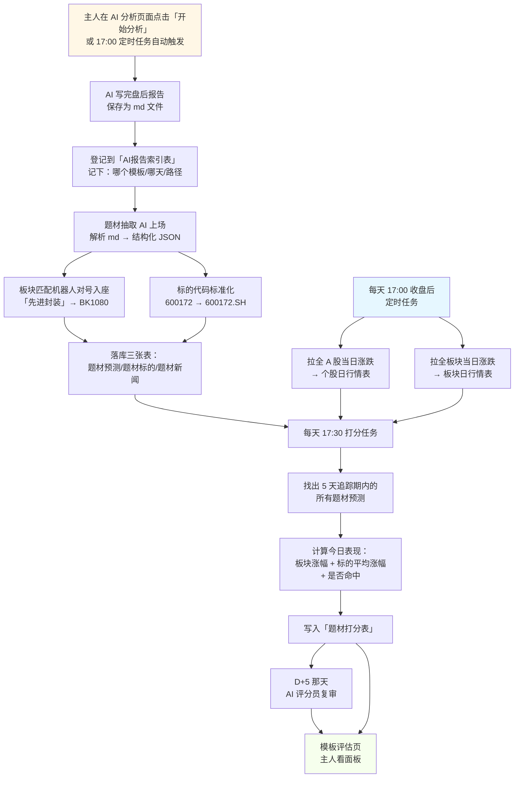

# 题材抽取与打分系统·完整流程通读版

> 主人通读版（中文化无英文术语）  
> 配套技术文档：[05-27-1003-题材抽取保存与GUI补全设计.md](05-27-1003-题材抽取保存与GUI补全设计.md)  
> 编写时间：2026-05-27 10:25  
> 编写人：辉夜

---

## 一句话总结

> **「AI 写盘后报告 → 抽出预测题材 → 每天对账实际涨跌 → 5 天后给每份预测打分 → 主人看哪个模板更准」**

整套流程跑通后，主人就能定量回答：
- 「短线投机·实战派」模板比「数据派」模板准还是不准？
- 我加了一句"重点关注超跌反弹"后，第二版模板有改进吗？
- 上周哪份报告完全是 AI 在瞎编？

---

## 二、一图流



---

## 三、中英文名词对照表

> 后续技术文档会用左列的英文名，主人只需要记住右列的中文意思。

### 数据库表（共 10 张）

| 英文表名 | 中文叫法 | 干啥用 | 一行一条什么 |
|---|---|---|---|
| `ai_reports` | **AI报告索引表** | 登记每份 md 的"身份证" | 一份报告 |
| `theme_predictions` | **题材预测表** | 报告里抽出的每个题材 | 一个题材 |
| `theme_stocks` | **题材标的表** | 每个题材里的具体股票 | 一只标的 |
| `theme_news` | **题材新闻表** | 每个题材关联的新闻 | 一条新闻 |
| `fact_stock_daily` | **个股日行情表** | 全 A 股每天的涨跌 | 一只股×一天 |
| `fact_sector_daily` | **板块日行情表** | 全板块每天的涨跌 | 一个板块×一天 |
| `theme_prediction_scores` | **题材打分表** | 每个题材每天一次分 | 一个题材×一天 |
| `theme_stock_scores` | **标的打分表** | 每个标的每天一次分 | 一只标的×一天 |
| `dim_sector` | **板块维度表** | 所有板块（含代码） | 一个板块 |
| `dim_stock` | **股票维度表** | 所有股票（含名称） | 一只股 |

### 字段（重点几个）

| 英文字段名 | 中文叫法 | 含义 |
|---|---|---|
| `prompt_id` | **模板代号** | 如 `speculator_scalper` |
| `prompt_version` | **模板版本号** | 如 `1.0` `2.0` |
| `report_path` | **报告路径** | 相对路径，如 `data/AI_analysis/5月27日/xxx.md` |
| `strength_score` | **强度分** | -100~100，负数=利空 / 正数=利多 |
| `strength_level` | **强度等级** | 9 级文字标签，从「重大利空」到「重大利多」 |
| `sector_ts_code` | **板块代码** | 如 `BK1080`（先进封装）|
| `normalized_code` | **标准化股票代码** | 如 `600172.SH`（带后缀） |
| `pct_chg` | **涨跌幅** | 单日百分比 |

---

## 四、流程分阶段详解

### 阶段一·出生：AI 写完一份盘后报告

**谁触发？**
- 主人在 AI 分析页面点「开始分析」
- 或：定时任务每天 17:30 自动跑

**系统做了什么？**
1. AI 调用大模型（DeepSeek / 智谱 / 通义千问）生成分析正文
2. 保存为 markdown 文件，路径示例：  
   `data/AI_analysis/5月27日/5月27日_17时30分_盘后总结分析报告.md`
3. 同时在「AI报告索引表」里**登记一条**，相当于给这份报告办身份证：

   | 字段 | 含义 | 示例值 |
   |------|------|--------|
   | 报告路径 | md 在哪 | `data/AI_analysis/5月27日/xxx.md` |
   | 模板代号 | 用了哪份提示词 | `speculator_scalper` |
   | 模板版本 | 第几版 | `1.0` |
   | 报告日期 | 哪天的盘后 | `20260527` |
   | 报告时间 | 几点几分生成 | `2026-05-27 17:30` |
   | 抽取状态 | 题材有没有抽过 | `pending` / `done` / `failed` |

**主人能看到什么？**
- `data/AI_analysis/5月27日/` 下多出一份新 md 文件
- AI 分析页面下方显示「分析完成」

---

### 阶段二·解读：题材抽取员上场

**谁触发？**
- 阶段一报告生成完即自动触发（默认行为）
- 或：主人在「题材预测页」上半区选中某份 md 手动点「抽取」按钮

**系统做了什么？**
1. **读 md 全文**，按章节切片传给题材抽取 AI（一份单独的提示词模板 `extract_themes`）
2. AI 返回结构化 JSON：

   ```
   {
     "themes": [
       {
         "题材名": "先进封装",
         "强度分": 75,
         "强度等级": "中等利多",
         "理由": "存储芯片涨价 + Chiplet 渗透率提升",
         "标的列表": [
           {"代码": "600171", "名称": "上海贝岭", "原因": "封装产能"},
           {"代码": "603005", "名称": "晶方科技", "原因": "CIS 封装龙头"}
         ],
         "关联新闻": ["news_2026_0527_001"]
       },
       ...
     ]
   }
   ```

3. **板块匹配机器人（matcher.py）上场**：把"先进封装"这种文字 → 真正的板块代码
   - 查「板块维度表」做模糊匹配
   - 匹配成功 → 填入 `板块代码 = BK1080`，置信度 = 0.95
   - 匹配失败 → 留空 + 标记需人工补
   - **为什么不直接让 AI 给代码？** 实测 DeepSeek V4 Pro 准确率仅 7.4%，AI 容易瞎编（详见 [tools/test_ai_sector_code_accuracy.py](../../tools/test_ai_sector_code_accuracy.py)）

4. **标的代码标准化**：`600172` → `600172.SH`、`002594` → `002594.SZ`
   - 沪市规则：6 开头 → `.SH`
   - 深市规则：0/3 开头 → `.SZ`
   - 北交所：8/4 开头 → `.BJ`

5. **路径统一规范化**（主人 10:25 拍板）：所有写入数据库的 `报告路径` 字段，统一调用同一个工具函数转成「相对 posix 路径」（如 `data/AI_analysis/5月27日/xxx.md`），避免 Windows 反斜杠/绝对路径混进来后下游反查失败。

6. **幂等防护**：先查这份报告之前抽过没？
   - 抽过 → 先删旧的（连带删旧的题材标的、题材新闻），再写新的
   - 没抽过 → 直接写
   - **为什么要这样？** 主人可能手动重跑抽取（比如换了新版抽取模板），不防护就会同题材重复入库、打分时双倍计入

7. **落库三张表**：
   - 「题材预测表」：写一条题材记录，带模板代号、版本、报告路径、板块代码、置信度
   - 「题材标的表」：写所有标的，带标准化代码
   - 「题材新闻表」：写所有关联新闻

**主人能看到什么？**
- 题材预测页表格立刻刷新，多出新报告的题材行
- 每行带「模板」列（显示友好名 `A股短线投机·实战派` 而不是 `speculator_scalper`）

---

### 阶段三·行情同步：每日全市场数据入库

**谁触发？**
- 每天收盘后 17:00 定时任务（独立于 AI 分析）

**系统做了什么？**
1. 调用 Tushare `daily` 接口，拉全 A 股 ~5400 只个股的当日涨跌幅
   - 字段：股票代码、开盘价、收盘价、最高价、最低价、成交量、**涨跌幅**
   - 写入「个股日行情表」，主键 = (股票代码, 交易日)
2. 调用 Tushare 板块成份接口，算出全板块 ~480 个的当日涨跌幅
   - 字段：板块代码、板块名、**板块涨跌幅**、成份股数量
   - 写入「板块日行情表」，主键 = (板块代码, 交易日)

**为什么要全量？**
- 主人的题材预测随便挑哪只股、哪个板块都要能查到→ 必须有底数
- 30 天回填一次 → 16 万行个股 + 1.4 万行板块，磁盘占用 ~50MB，可接受

**主人能看到什么？**
- 后台无感，跑完后查 `data/market.db` 多了两张表的数据
- 失败时在题材预测页右下角弹「行情同步失败」红色提示

---

### 阶段四·对账：每天给昨天的预测打分

**谁触发？**
- 每天行情入库完成后 17:30 定时任务

**系统做了什么？**

1. **找出还在追踪期内的所有题材**：  
   ```
   SELECT * FROM 题材预测表
   WHERE 报告日期 BETWEEN 今天-5天 AND 今天-1天
   ```
   也就是「过去 5 天生成的所有预测」，最早的算 D+5，最晚的算 D+1。

2. **对每个题材计算今日表现**：

   | 指标 | 怎么算 |
   |------|--------|
   | **板块涨幅** | 从「板块日行情表」查 `(板块代码, 今天)` 的涨跌幅 |
   | **标的平均涨幅** | 题材内所有标的，从「个股日行情表」查今日涨幅，求平均 |
   | **加权标的涨幅** | 按 AI 给的强度分加权平均（强度高的占比大） |
   | **命中率** | 标的中今日涨幅 > 阈值（如 3%）的占比 |
   | **绝对得分** | 命中率 × 100，比如 5 只中 3 只涨超 3% → 60 分 |
   | **相对得分（Alpha）** | 题材平均涨幅 − 大盘涨幅，剔除大盘影响 |
   | **方向是否正确** | 强度分 > 0（看多）且板块涨幅 > 0 → 方向对 |

3. **写入「题材打分表」**：每个题材每天写一行：

   | 字段 | 示例 |
   |------|------|
   | 题材ID | `123`（来自题材预测表）|
   | 模板代号 | `speculator_scalper` |
   | 模板版本 | `1.0` |
   | 报告日期 | `20260527` |
   | 打分日期 | `20260528` |
   | 距 D+几 | `1`（即 D+1） |
   | 板块涨幅 | `+2.3%` |
   | 标的平均涨幅 | `+1.8%` |
   | 加权标的涨幅 | `+2.1%` |
   | 命中数/总数 | `3/5` |
   | 绝对得分 | `60` |
   | 相对得分（Alpha） | `+1.5%`（大盘当天 +0.3%） |
   | 方向正确? | `是` |

4. **同时写入「标的打分表」**（粒度更细）：每只标的每天一行，方便事后复盘哪只 AI 选错了。

**主人能看到什么？**
- 模板评估页表格自动多出今天的数据
- 题材预测页详情区第 4 个 Tab「打分明细」也会出现今日新行

---

### 阶段五·5 天追踪期

> 为什么是 5 天？短线投机的题材生命周期通常 3~7 天，5 天能盖住主升浪 + 衰退期，又不会过长导致与下一轮新预测混淆。

```
报告生成日   T+0
  ↓ +1天
打分（D+1）  → 看是否启动
  ↓ +1天
打分（D+2）  → 看是否扩散
  ↓ +1天
打分（D+3）  → 看主升浪
  ↓ +1天
打分（D+4）  → 看是否高位横盘
  ↓ +1天
打分（D+5）  → 终评 + AI 复审
```

- **D+1**：题材有没有"开盘就走"？快进快出策略最看重
- **D+3**：是否进入主升浪？大资金接力的最佳验证点
- **D+5**：终评，AI 评分员上场复审

**遇到周末/节假日怎么办？**
- 自动跳过非交易日，D+1 = 下一个交易日，不按自然日算
- 比如周五生成的预测，D+1 = 下周一

---

### 阶段六·AI 评分员复审（D+5 那天）

**谁触发？**
- 每天 17:30 打分任务结束后，扫描所有今日 D+5 的题材，逐个调 AI

**系统做了什么？**
1. 把以下内容打包给 AI 评分员：
   - 原始题材预测（题材名、强度分、理由、标的列表）
   - 5 天实际表现（每天板块涨幅、标的涨幅、是否命中）
   - 同期大盘涨跌
2. AI 给出**定性评语**（三选一 + 评语文字）：
   - 🟢 **事前能看出**：理由扎实、数据有支撑、5 天走势验证
   - 🟡 **运气好/差**：方向蒙对但理由站不住，或方向错但巧合反弹
   - 🔴 **明显错误**：理由有事实错误，或忽视了关键风险点
3. AI 评语写入「题材打分表」的 `ai_review` 字段（D+5 行）

**为什么要 AI 复审？**
- 脚本打分只看涨跌结果，不看"为什么"
- 同样 D+5 涨 5%，可能是：
  - A：AI 预测的"业绩超预期"理由真的兑现了 → 高质量预测
  - B：AI 给了"业绩超预期"理由，但其实涨是因为另一个无关消息 → 蒙对
- AI 复审能区分这两种情况，帮主人判断模板的真实能力

**去重保护**（review 阶段补丁 P9）：  
同一个题材如果同一天被多份报告抽到（比如早盘报告 + 晚盘报告都提到了「先进封装」），AI 只评估一次，结果共享，节省 LLM 调用成本。

**主人能看到什么？**
- 模板评估页表格中 D+5 行出现彩色标记（🟢🟡🔴）
- 鼠标悬停看到 AI 评语全文

---

### 阶段七·主人看面板

#### 7.1 题材预测页（现有页面增强）

**上半区**：
- 选 md 文件 → 显示报告正文 + 抽取按钮（不变）

**下半区**（新增列）：
| 题材名 | 强度分 | 模板（友好名） | D+1分 | D+3分 | D+5分 | AI评 |
|--------|--------|----------------|-------|-------|-------|------|
| 先进封装 | 🟢+75 | A股短线投机·实战派 | 60 | 80 | 70 | 🟢 |
| 黄金股 | 🔴-40 | A股短线投机·数据派 | 30 | 50 | 40 | 🟡 |

- 强度分带色：负数红、正数绿、|分| 越大越深
- 上方加「模板筛选下拉」，选中只看某模板（友好名显示，不显示英文 ID）

**详情区第 4 个 Tab「打分明细」**（新增）：
- 选中某题材后，本 Tab 显示该题材 5 天追踪期的逐日表现
- 折线图：板块涨幅 vs 标的平均涨幅 vs 大盘涨幅（三线对比）

#### 7.2 模板评估页（**全新页面**）

**控制条**：
- 时间范围下拉（最近 7 天 / 30 天 / 90 天 / 自定义）
- 「忽略版本号」复选框（默认勾选，把 v1.0 / v2.0 合并看长期趋势；不勾就分版本展示）
- 「重打分」按钮（点了之后弹确认框）
- 「导出 CSV」按钮

**主表**：
| 模板名 | 版本 | 样本数 | D+1平均分 | D+3平均分 | D+5平均分 | 平均Alpha | 命中率 | AI高质量占比 |
|--------|------|--------|-----------|-----------|-----------|-----------|--------|--------------|
| 短线投机·实战派 | @1.0 | 28 | 55 | 62 | 58 | +1.2% | 55% | 60% |
| 短线投机·数据派 | @1.0 | 15 | 48 | 52 | 50 | +0.8% | 50% | 45% |
| 短线投机·实战派 | @2.0 | 4 ⚠️ | 70 | 75 | 72 | +2.1% | 70% | 80% |

- 样本数 < 5 的单元格底色变浅橙 + 鼠标悬停提示「样本不足，建议 ≥ 5」
- D+1/D+3/D+5 分数越高底色越绿

**折线图区**：
- 选 2~3 个模板对比 30 天 D+5 平均分走势
- 横轴 = 报告日期，纵轴 = 平均分
- 用 PyQtChart 实现（已有依赖，零成本）

**主人最常用**：
- 想知道哪个模板最准 → 看「平均Alpha」列降序
- 想看新版本有没有改进 → 取消勾选「忽略版本」，对比 @1.0 vs @2.0
- 想做月度复盘 → 时间范围选「最近 30 天」+ 导出 CSV

---

## 五、几个关键设计取舍说明（主人需要知道的"为什么"）

### Q1：为什么不让 AI 直接给板块代码？

**实测：DeepSeek V4 Pro 准确率仅 7.4%（27 个板块只猜对 2 个），剩下的 25 个全是凭空捏造的 BK 代码。**

→ 决定：用 matcher 模糊匹配「板块名→代码」，AI 只负责给板块名。  
→ 未来 DeepSeek V5 / 接其他模型时，可重跑 `tools/test_ai_sector_code_accuracy.py` 验证是否能改。

### Q2：为什么追踪期定 5 天而不是 3 天或 10 天？

- 3 天：盖不住主升浪扩散，容易误判"未启动 = 失败"
- 10 天：跟下一轮新预测重叠太多，统计上容易互相干扰
- 5 天：覆盖快进快出 + 主升浪 + 高位见顶，是 A 股短线题材的标准生命周期

### Q3：脚本打分和 AI 打分要不要二选一？

不要，两者互补：
- **脚本**：客观、稳定、可量化、跑 1 万次得 1 万次同样结果 → 用于排名和趋势
- **AI**：能看"为什么"，能识别"运气 vs 实力" → 用于复盘和模板优化方向

模板评估页会同时显示「脚本平均分」+「AI 高质量占比」，主人对照看。

### Q4：报告路径为什么要统一规范化？

主人 10:25 已拍板用「统一规范化」方案：
- **问题**：`ai_reports.file_path` 存的是相对 posix（如 `data/AI_analysis/...`），但题材表的 `report_path` 历史上存的是 `os.path.abspath()` 绝对 Windows 路径（如 `F:\NewsTrading\data\AI_analysis\...`）
- **结果**：下游查"这份题材来自哪个模板？"永远查不到
- **修复**：所有写入处统一调用 `_to_relative_posix()`，把路径强制压成相对 posix 格式
- **为什么不用 report_id 强 FK 替代 report_path？** 

> ⚠️ **重要订正（第二轮 review 发现）**：现状下「题材预测表的 report_id」和「AI 报告索引表的 id」是**两个完全不同的概念**：
> - `theme_predictions.report_id` = 报告**文件名 string**（如 `5月22日_18时25分_盘后总结分析报告`）
> - `ai_reports.id` = 数据库**自增整数**（如 `123`）
> 
> 两者**无法直接 join**！所以反查 prompt_id **必须**走 `report_path`，没有捷径。  
> 如果将来想升级到 FK，需要单独立项：先把 `theme_predictions.report_id` 字段从 TEXT 改 INTEGER，再回填所有历史数据，是大 schema 变更，不在本次范围。

### Q5：同一份报告抽两次会重复入库吗？

**修复后不会**：抽取入口先 `DELETE FROM 题材预测表 WHERE report_id = ?`，再插入新版（连带级联删除 题材标的、题材新闻 子表）。  
→ 主人手动重跑抽取（换新版抽取模板时）也是安全的。

### Q6：模板升级了（v1.0 → v2.0），老数据要怎么算？

默认按 `(模板代号, 模板版本)` 二元组聚合，模板评估页表格把 v1.0 和 v2.0 分两行展示。  
主人想看长期趋势 → 勾选「忽略版本号」，合并所有版本。  
两种视图都支持。

### Q7：题材预测被删了，对应打分记录怎么办？

打分表设了「外键 + 级联删除」（review 阶段补丁 P3）。  
主人在 GUI 点「删除当前报告题材」时，打分记录会自动一起清，不会留孤儿数据。

---

## 六、数据库表全清单（含中文别名）

```
data/news.db
├── ai_reports               AI报告索引表       一份 md 一行
├── theme_predictions        题材预测表         一个题材一行
├── theme_stocks             题材标的表         一只标的一行（FK→题材预测表）
├── theme_news               题材新闻表         一条新闻一行（FK→题材预测表）
├── theme_prediction_scores  题材打分表         一题材×一天一行（FK→题材预测表 + CASCADE）
└── theme_stock_scores       标的打分表         一标的×一天一行（FK→题材预测表 + CASCADE）

data/market.db
├── dim_sector               板块维度表         一个板块一行（含代码）
├── dim_stock                股票维度表         一只股一行（含名称）
├── fact_stock_daily         个股日行情表       一只股×一天一行（全 A 股）
└── fact_sector_daily        板块日行情表       一个板块×一天一行（全板块）
```

总计 **10 张表**，新增 4 张（`fact_stock_daily` `fact_sector_daily` `theme_prediction_scores` `theme_stock_scores`），其余 6 张已经存在或本次扩字段。

---

## 六·B、接入现有定时调度系统

> 第二轮 review 时发现 NewsTrading 已经有完整的定时调度系统（见 [core/scheduler_service.py](../../core/scheduler_service.py) + [services/scheduled_runner.py](../../services/scheduled_runner.py)），可以在 GUI「定时任务管理」页面直接看/改。  
> **本系统不新建调度器，全部接入现有 scheduler。**

### 现有任务类型（主人见过的）

| 任务类型代号 | 中文标签 | 主人能在哪开关 |
|--------------|---------|--------------|
| `crawl_sync` | 数据获取（爬取入库） | GUI ⏰ 定时任务页 |
| `clean_sync` | 数据清理（AI清洗） | GUI ⏰ 定时任务页 |
| `analyze` | 新闻分析 | GUI ⏰ 定时任务页 |
| `market_fetch` | 盘后数据拉取 | GUI ⏰ 定时任务页 |

### 本系统新增 4 个任务类型

| 任务类型代号 | 中文标签 | 触发时间 | 干啥 |
|--------------|---------|---------|------|
| `stock_daily_sync` | 个股日行情同步 | 每日 17:00 | 拉全 A 股 ~5400 只个股当日涨跌 → 个股日行情表 |
| `sector_daily_sync` | 板块日行情同步 | 每日 17:00 | 拉全板块 ~480 个当日涨跌 → 板块日行情表 |
| `theme_score_daily` | 题材每日打分 | 每日 17:30 | 给 5 天追踪期内所有题材跑脚本打分 |
| `theme_ai_review` | AI 评分员复审 | 每日 17:35 | 扫今日 D+5 题材交 AI 复审 |

**主人能怎么用？**

- 打开 GUI ⏰ 定时任务页，看到下拉里多出 4 个新类型，可以新建/编辑/暂停
- 默认 4 个任务**安装时不自动启用**，主人审阅施工后手动勾「启用」
- 失败时定时任务页"上次执行"列变红，鼠标悬停看到错误信息

### 任务依赖关系

```
17:00  stock_daily_sync  ←┐
17:00  sector_daily_sync ←┘  必须都跑完
17:30  theme_score_daily     ←  依赖上面两个（缺数据则跳过当日打分）
17:35  theme_ai_review       ←  依赖 theme_score_daily（缺脚本分则跳过 AI 复审）
```

**为什么不放一个大任务里？** 拆开后任何一步失败可以单独重试，调度页能精确看到卡在哪。

---

## 七、施工里程碑（与现有 plan 对齐）

| 阶段 | 里程碑 | 工期 | 状态 |
|------|--------|------|------|
| M0 | 题材抽取保存 + GUI 补全（v3+v4 合并） | ~1.5 天 | 🟡 设计完，待主人审批开工 |
| M1 | 个股 / 板块日行情同步任务 | ~0.5 天 | ⚪ 未开工 |
| M2 | 板块匹配机器人 matcher.py | ~0.5 天 | ⚪ 未开工（在 M0 内顺带做） |
| M3 | 每日打分任务（脚本部分） | ~1 天 | ⚪ 未开工 |
| M3.3 | AI 评分员（D+5 复审） | ~0.5 天 | ⚪ 未开工 |
| M4 | 模板评估页（全新 GUI） | ~1 天 | ⚪ 未开工 |
| M5 | 端到端联调 + 30 天回填 | ~0.5 天 | ⚪ 未开工 |

**总计**：~5.5 个工作日。  
**关键路径**：M0 → M1 → M3 → M4（M2 内嵌、M3.3 可并行）。

---

## 八、常见问题（主人版）

### Q：要是 AI 抽题材时 JSON 格式错了怎么办？
A：四级容错机制：标准 JSON → 容错括号补全 → 正则提取 → 全空 + 标记 failed。最差情况下报告进入「待补」状态，主人可以点重抽。

### Q：要是 Tushare 行情接口挂了怎么办？
A：当日打分自动延期到下一个交易日重试；连续 3 天失败弹红色告警。

### Q：D+5 当天 AI 评分员调用失败怎么办？
A：脚本打分正常入库，AI 评语字段留 `pending`；每天 18:00 有重试任务扫描所有 `pending` 行补评。

### Q：跑 30 天回填要多久？
A：Tushare daily 接口按日拉，30 天 = 30 次请求（每次 ~5400 行个股 + 480 行板块），单次 ~3 秒，纯接口耗时 ~1.5 分钟；加上打分计算约 5~10 分钟。可后台跑。

### Q：主人想把某份预测从评估里剔除（认为是异常样本）怎么办？
A：题材预测页右键菜单加「标记为异常样本」（一期未做，二期补），打分聚合时自动跳过。

### Q：AI 评分员每月大概要花多少钱？

按经验估算（30 天 × 平均 2 个模板 × 平均 4 个题材 × 1 次 AI 评分 ≈ 240 次 LLM 调用）：

| 模型 | 单次成本 | 30 天总价 |
|------|---------|----------|
| DeepSeek V4 Pro | ~$0.01 | **~$2.4** |
| Claude 3.5 Sonnet | ~$0.03 | ~$7 |
| GPT-4 Turbo | ~$0.05 | ~$12 |

→ 推荐用 DeepSeek，性价比最高。  
→ 如果主人临时想用 GPT-4 跑某段时间复审，去 AI 分析页面切换 provider 即可，不需要改代码。

### Q：「重打分」按钮会重新调 AI 吗（怕烧钱）？

**不会**。

- 「重打分」**只重算脚本分**（D+1~D+5 的板块涨幅、标的平均涨幅、命中率等）
- AI 评语保留不变（因为重跑 AI 不仅贵，结果还有随机性，同一份预测两次评语可能不同）
- 如果主人确实想重跑 AI 评分员，需要另开「重跑 AI 复审」入口（一期未做，二期需要再考虑）

按钮提示文案：「重打分会用最新算法重算所有脚本分，不会重新调 AI 评分员。约耗时 N 秒。」

### Q：标的代码（如 600172）怎么变成标准代码（600172.SH）？

按三级优先级走：

1. **dim_stock 精确匹配**（首选，最稳）  
   主人 5/26 已经把 5522 只在市 A 股入库到「股票维度表」，按 6 位代码反查能直接拿到带后缀的完整代码。
2. **后缀规则兜底**（dim_stock 没查到时用）  
   - 6 开头 → `.SH`（沪市主板 / 科创板）
   - 0 / 3 开头 → `.SZ`（深市主板 / 创业板）
   - 8 / 4 开头 → `.BJ`（北交所）
3. **标记需人工**（既没在 dim_stock 也不匹配规则）  
   GUI 题材预测页给这种标的标红，方便主人手动改。

**为什么不直接用规则？** 实际有"688310"（科创板）"300750"（创业板）"832023"（北交所）等多个细分场景，规则容易踩坑；dim_stock 查表最稳。

---

## 九、辉夜的最后一句话

主人这套设计走通后，等于把"AI 写报告 → 我看准不准"这件玄学的事**变成可统计、可追溯、可优化的工程**。3 个月跑下来积累 200~500 份样本，主人就能给每个模板贴一个客观标签（如「短线投机·实战派 = D+3 平均 Alpha +2.1%，命中率 60%」），那时候选模板就不靠感觉了。

下面就等主人审批 → 辉夜开工。

---

## 关联文档

- [05-27-1003-题材抽取保存与GUI补全设计.md](05-27-1003-题材抽取保存与GUI补全设计.md) — 技术细节版（决策表 / DDL / 行号级 diff）
- [_施工_抽取保存GUI补全.md](../../.huiye/_施工_抽取保存GUI补全.md) — 施工 checklist（辉夜内部用）
- [05-27-0949-题材强度评分带符号化.md](../updates/05-27-0949-题材强度评分带符号化.md) — v3 强度分带符号化（已并入本流程）
- [tools/test_ai_sector_code_accuracy.py](../../tools/test_ai_sector_code_accuracy.py) — AI 板块代码准确率回归测试
