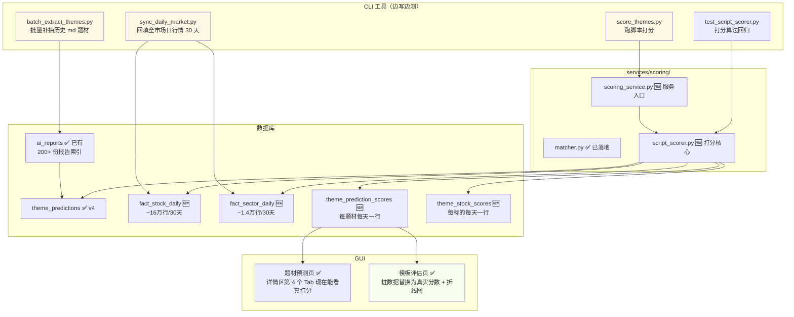

# 模板回测功能·设计通读版

> 主人通读版（中文化无英文术语）
> 编写时间：2026-05-27 11:40
> 编写人：辉夜
> 配套上层文档：[05-27-1025-题材抽取打分完整流程.md](05-27-1025-题材抽取打分完整流程.md)（端到端日常使用流程）
> 配套下层文档：[05-27-1003-题材抽取保存与GUI补全设计.md](05-27-1003-题材抽取保存与GUI补全设计.md)（v4 schema 技术细节）

---

## 一句话总结

> **「把已经躺在硬盘里的 200+ 份 AI 报告 + 30 天行情 → 算出每个模板的真实历史得分 → 让主人知道哪个模板靠谱、哪个模板凭运气」**

回测功能上线后，主人就能定量回答这些问题：

- 我手头 13 个 prompt 模板，过去 30 天**真实**表现谁第一谁最末？
- 「短线投机·实战派」上周改了一句"重点关注超跌反弹"后，**第二版真的比第一版好吗**？
- 哪份报告完全是 AI 在瞎编（D+5 全军覆没）？
- 哪个 prompt 模板**只在牛市能用、熊市直接拉胯**？

---

## 一、回测有两种形态（必须先理解清楚）

### 形态 A · 事后打分回测（最小可行）

```
已有的 md 报告（200+ 份） 
   ↓ 自动补抽题材入库（已实施 v4 流程）
   ↓ 用历史行情对每条预测算 D+1~D+5 分
   ↓ 聚合到模板维度（按 prompt_id + 版本）
   ↓ 模板评估页看真实分数
```

**特点**：
- 模板**不变**，只是给历史报告**补打分**
- 用的是「真实已生成」的 md，**零 LLM 调用**
- 成本：~5 分钟跑 200 份报告 × 5 天追踪
- **局限**：只能评估已发布过的模板；新写的模板还得等真实上线 + 5 天才有数据

### 形态 B · 事前虚拟回测（强模式）

```
锚定「2026-05-20 收盘后」这个历史时间点
   ↓ 严格还原当时能看到的新闻 + 盘后数据（防穿越）
   ↓ 用「新版模板」重新跑一次 AI 分析 → 生成"虚拟 md"
   ↓ 抽题材
   ↓ 用 5/21~5/25 的真实行情打分
   ↓ 进入与 A 相同的聚合流程
```

**特点**：
- 模板可以是**全新的**，不用等真实上线
- 主人改了 prompt 后**立刻**能知道 v2 是否好过 v1（不用等 5 天）
- 成本：每次回测一次 LLM 调用（~$0.01 DeepSeek）
- **难点**：**严格防穿越**——只能用 T 日 16:00 之前的信息

### 辉夜推荐：**先 A 后 B，分两期落地**

| 理由 | 详情 |
|------|------|
| ① A 几乎零返工 | A 利用已有 200+ md + ai_reports 表 + v4 schema + 模板评估页骨架，几乎是"骨架填肉"；B 要单独造"快照还原 + 防穿越"机制 |
| ② A 跑通后立刻有成果 | 主人能看到"现有 13 个模板的真实历史得分排名"这个数字 |
| ③ B 风险高，先稳基础 | B 的快照重建容易踩坑（数据穿越 / 时区 / 异常样本），等 A 验证打分链路稳定后再做 |

---

## 二、一图流（一期形态 A）



---

## 三、关键产品决策（**主人必须先拍板**）

辉夜整理了 6 个必须主人决定的关键点，决定后辉夜才能写施工文档。以下每个都附辉夜的推荐选项。

### 决策 1 · 实施顺序

| 选项 | 描述 | 辉夜推荐 |
|------|------|---------|
| ✅ **A 一期 + B 二期**（共 ~5 天） | 先 A 跑通看效果，再 B 加虚拟回测 | ⭐ 推荐 |
| 只做 A | ~2 天，能看历史模板表现，但新模板得等 5 天才能验证 | 也行，但二期不补会很可惜 |
| 直接 B（A 顺带做） | ~4 天，一步到位但风险大 | 不推荐 |
| A + B 并行 | ~5 天，复杂度高 | 不推荐 |

### 决策 2 · 脚本打分的核心指标（可多选）

**辉夜推荐**：先把 5 个全做（成本一样，都是一次 SQL 算出来），主人在评估页可以选择按哪个排序：

| 指标 | 含义 | 说明 |
|------|------|------|
| ✅ **命中率** | 标的中涨幅 > 阈值（默认 3%）的占比 | 最直观，主人最关心 |
| ✅ **标的平均涨幅** | 题材内所有标的当日涨跌幅算术平均 | 基础指标 |
| ✅ **加权平均涨幅** | 按 AI 强度分加权（强度高的票占比大） | 体现 AI 判断质量 |
| ✅ **板块涨幅** | matcher 配上的板块当日涨幅 | 最稳定的指标（板块平均比单票稳） |
| ✅ **Alpha** | 题材涨幅 − 大盘涨幅 | **最重要**，剔除大盘影响 |
| ✅ **方向正确率** | 看多 + 真涨 / 看空 + 真跌 | 验证 AI 对**方向**的判断 |

→ 全做。GUI 默认按 Alpha 排序，主人可切换。

### 决策 3 · 追踪期长度

| 选项 | 适用 | 辉夜推荐 |
|------|------|---------|
| D+3 | 快进快出 / 主升浪初期 | ❌ 太短，盖不住扩散 |
| ✅ **D+5** | 标准短线题材生命周期 | ⭐ 推荐（与之前流程文档一致） |
| D+10 | 中线题材 | ❌ 太长，与下一轮预测重叠 |
| 可配置 | 评估页选择不同窗口 | 建议二期再做 |

→ 一期固定 D+5，未来可扩展。

### 决策 4 · 历史回填范围

| 选项 | 数据量估算 | 辉夜推荐 |
|------|-----------|---------|
| 7 天 | ~50 份 md + 3.8 万行行情 | ❌ 太少，样本不够 |
| 30 天 | ~200 份 md + 16 万行行情 | 推荐 |
| 60 天 | ~400 份 md + 32 万行行情 | 可考虑（看 ai_reports 实际数据） |
| ✅ **ai_reports 有多少跑多少** | 全量 | ⭐ 推荐（一次性付清存储成本） |

→ 全量跑。Tushare daily 接口按日拉，30 次请求 × 3 秒 ≈ 1.5 分钟。

### 决策 5 · fact_stock_daily 存储范围

| 选项 | 大小 | 适用 |
|------|------|------|
| ✅ **全 A 股 ~5400 只** | ~50 MB / 30 天 | ⭐ 推荐（未来任意题材都能回测） |
| 只存历史题材里出现过的票 | ~10 MB / 30 天 | 不推荐（扩展受限） |
| 只存板块涨跌不存个股 | ~1 MB / 30 天 | 不推荐（无法标的级打分） |

→ 全量，省心一劳永逸。

### 决策 6 · AI 评分员（D+5 定性复审）

| 选项 | 成本 | 辉夜推荐 |
|------|------|---------|
| 一期就上 | ~$2.4/月 DeepSeek | 可以，但二期更稳 |
| ✅ **二期再加** | 一期先看脚本分够不够用 | ⭐ 推荐 |
| 不做 | 0 | 不推荐，会少一维定性指标 |

→ 一期专注脚本分；二期再加 AI 评分员。

---

## 四、一期·形态 A 的具体流程

### 阶段 1 · 历史数据补齐（一次性，~10 分钟）

**主人操作**：在终端跑两个命令：

```bash
# 批量补抽历史 md 的题材（约 200 份，每份 ~10 秒，并行 4 个 ~10 分钟）
python tools/batch_extract_themes.py --all --workers 4

# 回填全市场日行情 30 天（~1.5 分钟）
python tools/sync_daily_market.py --days 30
```

**系统做了什么**：

1. **批量抽题材**：扫描 `ai_reports` 表里所有 `theme_extracted=0` 的报告，逐个调题材抽取流程入库
2. **回填行情**：
   - 拉 Tushare daily 接口，30 个交易日 × 5400 只个股 → `fact_stock_daily` 表
   - 拉板块行情 → `fact_sector_daily` 表
3. **进度反馈**：每跑完 10 份打印一行 `[OK] 100/200`，失败的进 `data/extract_failures.log`

### 阶段 2 · 跑历史打分（一次性，~5 分钟）

```bash
python tools/score_themes.py --days 30
```

**系统做了什么**：

1. 查 `theme_predictions` 表里所有 30 天内的题材
2. 对每个题材，按追踪期内每一天（D+1 ~ D+5）：
   - 查 `fact_sector_daily` 拿板块涨幅
   - 查 `fact_stock_daily` 拿每只标的涨幅
   - 算 6 个指标（命中率 / 平均 / 加权 / 板块 / Alpha / 方向）
   - 写入 `theme_prediction_scores` 一行
3. 顺手算每只标的的独立得分 → `theme_stock_scores`

### 阶段 3 · 看面板

**模板评估页**（GUI）：

```
┌────────────────────────────────────────────────────────────────────────┐
│ 时间范围: [最近 30 天 ▼]  忽略版本号: [☑]  排序: [Alpha ▼]    [刷新]  │
├────────────────────────────────────────────────────────────────────────┤
│ 模板               版本  样本  D+1分  D+3分  D+5分  Alpha  命中率  方向│
├────────────────────────────────────────────────────────────────────────┤
│ 短线投机·实战派    @1.0   28    55     62     58   +1.2%   55%    62% │
│ 短线投机·数据派    @1.0   15    48     52     50   +0.8%   50%    55% │
│ 标准分析           @1.0   42    52     50     48   +0.3%   45%    50% │
│ 短线投机·实战派    @2.0    4⚠   70     75     72   +2.1%   70%    75% │
│ 三位一体综合       @1.0    8    40     45     42   −0.5%   35%    40% │
└────────────────────────────────────────────────────────────────────────┘
       ↓ 选 2~3 行勾选
┌────────────────────────────────────────────────────────────────────────┐
│ 折线图：30 天 D+5 平均分对比                                            │
│   ━━ 短线投机·实战派                                                    │
│   ━━ 短线投机·数据派                                                    │
│   ━━ 标准分析                                                          │
└────────────────────────────────────────────────────────────────────────┘
```

**题材预测页**（已有页面）：

- 第 4 个 Tab「打分明细」从「未上线提示」**升级为真实数据**：
  - 折线图：板块涨幅 vs 标的平均涨幅 vs 大盘涨幅（三线对比）
  - 表格：D+1~D+5 每天的所有指标
  - （二期）AI 评分员的评语

---

## 五、二期·形态 B 怎么做（简版）

二期再细化，这里只点核心思路：

### 1. 历史快照重建

新建 `services/scoring/snapshot.py`：

- `build_snapshot(trade_date, cutoff_hour=16)` → 返回当天 16:00 前能看到的所有数据
  - 新闻：`SELECT * FROM raw_news WHERE published_ts < cutoff_ts`
  - 盘后数据：`SELECT * FROM market_summaries WHERE trade_date = T-1`（**不能是 T**！）
  - 题材历史：可选给 AI 当上下文

### 2. 虚拟 md 生成

新建 CLI `tools/backtest_prompt.py`：

```bash
python tools/backtest_prompt.py \
    --template speculator_scalper \
    --date 2026-05-20 \
    --provider deepseek
```

输出：`data/backtests/speculator_scalper_20260520.md` + 标记 `is_backtest=1` 的 `ai_reports` 记录

### 3. 复用 A 的打分链路

虚拟 md 进入 `theme_predictions`（带 `is_backtest=1` 标记），自动被脚本打分覆盖。GUI 模板评估页加筛选：「仅真实 / 仅回测 / 全部」。

### 4. 防穿越检测器

- 每次 `build_snapshot` 后 assert：所有时间戳 < cutoff
- 单元测试：故意传入未来日期，必须报错

---

## 六、数据库新增 / 变更

### 新增 4 张表

| 表名 | 含义 | 一行一条什么 | 大小估算 |
|------|------|-------------|---------|
| `fact_stock_daily` | 个股日行情 | 一只股×一天 | ~16万行 / 30天 |
| `fact_sector_daily` | 板块日行情 | 一板块×一天 | ~1.4万行 / 30天 |
| `theme_prediction_scores` | 题材每日打分 | 一题材×一天 | ~1000行 / 30天 |
| `theme_stock_scores` | 标的每日打分 | 一标的×一天 | ~5000行 / 30天 |

### theme_prediction_scores 关键字段

| 字段 | 含义 |
|------|------|
| theme_id | 关联 theme_predictions.id（**FOREIGN KEY + ON DELETE CASCADE**，review P3） |
| prompt_id / prompt_version | 冗余自题材，方便聚合查询 |
| report_date | 题材生成日 |
| score_date | 打分日 |
| days_offset | D+几（1~5） |
| sector_pct | 板块当日涨幅 |
| stock_avg_pct | 标的平均涨幅 |
| stock_weighted_pct | 强度加权涨幅 |
| hit_count / total_count | 命中数 / 总数 |
| hit_rate | 命中率 |
| alpha | 题材涨幅 − 大盘涨幅 |
| direction_correct | 1 / 0 / NULL（方向是否正确） |
| ai_review_label | (二期) 事前能看出 / 运气 / 错误 |
| ai_review_comment | (二期) AI 评分员评语 |
| created_at | 入库时间 |

---

## 七、防穿越纪律（一期就要严格遵守）

即使一期只做 A，也要遵守这两条铁律，二期 B 才能稳：

### 铁律 1：打分用的行情必须是 D+1 之后

```python
# ❌ 错误：用今天的行情给今天的预测打分（穿越）
WHERE fact_stock_daily.trade_date = theme.report_date

# ✅ 正确：T+N 打分用 T+N 当天行情
WHERE fact_stock_daily.trade_date = next_trade_date(theme.report_date, N)
```

### 铁律 2：跨周末 / 节假日跳过

D+1 不是自然日 +1，是**下一个交易日**。依赖 `dim_trade_calendar` 表。

- 周五生成的预测，D+1 = 下周一
- 国庆假期前一天生成的预测，D+1 = 假期后第一个交易日

辉夜会写 `next_trade_date(date, n)` 工具函数 + 单元测试覆盖周末 / 节假日边界。

---

## 八、CLI 工具清单（一期 4 个，永久保留）

| 文件 | 用途 | 主人何时用 |
|------|------|----------|
| `tools/batch_extract_themes.py` | 批量补抽历史 md 题材 | 初次回填 / 新模板上线后补抽 |
| `tools/sync_daily_market.py` | 回填全市场日行情 | 每天 17:00 定时任务调（也可手动 catch-up） |
| `tools/score_themes.py` | 跑脚本打分 | 每天 17:30 定时任务调（也可手动重算） |
| `tools/test_script_scorer.py` | 打分算法回归 | 改打分算法后必跑 |

定时任务桩已经在 v4 阶段做了（plan M3 的 4 个任务类型），这次只是把桩函数替换为真实逻辑。

---

## 九、Q&A（主人版）

### Q：跑一次回测要多久？

- 阶段 1 一次性数据补齐：~10 分钟（200 份 md 抽取 + 30 天行情回填）
- 阶段 2 打分：~5 分钟
- **总计：~15 分钟**，后续每天定时增量同步

### Q：跑完之后能看到什么？

- 模板评估页：13 个模板按真实 Alpha 排名（一图秒懂）
- 题材预测页：每个题材详情区有「打分明细」Tab 看 5 天逐日表现
- CSV 导出：主人可以拉到 Excel 自己分析

### Q：模板得分多少算「好」？

参考标尺（A 股短线题材）：

| Alpha (D+5 平均) | 评价 |
|----------------|------|
| > +3% | 🟢 优秀（能稳定跑赢大盘 3 个点） |
| +1% ~ +3% | 🟡 良好（有 Alpha 但波动大） |
| −1% ~ +1% | ⚪ 普通（跟大盘差不多，模板没贡献） |
| < −1% | 🔴 反向指标（不如不用） |

样本数 ≥ 5 才算可信（< 5 染浅橙提示）。

### Q：如果某天行情极端（如黑天鹅），打分会不会失真？

会，但有两个缓解机制：

1. **D+1~D+5 多日聚合**，单日极端会被平滑
2. **Alpha 指标剔除大盘影响**，板块整体跌停不会让所有模板都死
3. （二期）AI 评分员能识别「运气好」vs「实力好」

主人也可以手动「标记为异常样本」剔除（二期补）。

### Q：跑完发现某个模板特别烂，怎么办？

- 看「方向正确率」：如果< 50%，说明 AI 对方向的判断有问题，可能 prompt 引导有偏
- 看「命中率」vs「板块涨幅」：如果板块涨但命中率低，说明 AI **选错了板块里的票**，要在 prompt 里强化选股逻辑
- 看 D+5 vs D+1：如果 D+1 高 D+5 低，说明只能玩当天反弹不能拿；反之说明 AI 预测的是慢热品种

### Q：模板升级了（v1 → v2），老数据要保留吗？

保留，但聚合时按 (prompt_id, prompt_version) 二元组分组（review P4 已确认）。模板评估页有「忽略版本号」开关，主人想看长期趋势就勾上。

### Q：B 期虚拟回测能不能跑「假设我两周前用了这个新模板，结果会怎样」？

可以，这正是 B 期的核心价值。流程：

1. 写新模板（如 `speculator_scalper_v3`）
2. 跑 `python tools/backtest_prompt.py --template speculator_scalper_v3 --date-range 2026-05-13..2026-05-26`
3. 系统会对每一天生成虚拟 md（共 10 次 LLM 调用，~$0.10）
4. 自动打分入库
5. 评估页选筛选「仅回测」即可看新模板的虚拟历史表现

---

## 十、实施里程碑

### 一期（形态 A）~2 天

| 子任务 | 工期 | 依赖 |
|--------|------|------|
| M1.1 fact_stock_daily / fact_sector_daily schema + migration | 1 小时 | 无 |
| M1.2 sync_daily_market.py CLI + Tushare 接入 | 3 小时 | M1.1 |
| M1.3 batch_extract_themes.py CLI（复用已有 v4 流程） | 1 小时 | 已有 ✅ |
| M1.4 theme_prediction_scores / theme_stock_scores schema + FK | 1 小时 | 无 |
| M1.5 services/scoring/script_scorer.py 核心算法 + 单测 | 4 小时 | M1.1, M1.4 |
| M1.6 services/scoring/scoring_service.py 服务入口 | 2 小时 | M1.5 |
| M1.7 score_themes.py CLI + test_script_scorer.py | 2 小时 | M1.6 |
| M1.8 scheduled_runner.py 替换 4 个桩为真实逻辑 | 1 小时 | M1.2, M1.6 |
| M1.9 模板评估页桩数据替换为真实数据 + 折线图 | 3 小时 | M1.6 |
| M1.10 题材预测页第 4 个 Tab 接真实打分 | 2 小时 | M1.6 |
| M1.11 端到端联调 + 30 天数据回填 + GUI 验收 | 2 小时 | 全部 |

**总计：~21 小时 ≈ 2 个工作日**（含 CLI 边写边测的成本）

### 二期（形态 B）~3 天

| 子任务 | 工期 |
|--------|------|
| M2.1 services/scoring/snapshot.py 历史快照重建 + 防穿越测试 | 4 小时 |
| M2.2 ai_reports 表加 is_backtest 标记 + 兼容现有逻辑 | 1 小时 |
| M2.3 tools/backtest_prompt.py 虚拟 md 生成 CLI | 4 小时 |
| M2.4 模板评估页加「真实 / 回测」筛选 + 并排对比 | 3 小时 |
| M2.5 AI 评分员实现（plan M3.3） | 4 小时 |
| M2.6 prompts/theme_review/theme_d5_review.md 复审模板 | 2 小时 |
| M2.7 端到端联调（用 speculator_scalper 跑 7 天回测验证） | 3 小时 |

**总计：~21 小时 ≈ 3 个工作日**

---

## 十一、风险与应对

| 风险 | 应对 |
|------|------|
| 200 份 md 批量抽取可能踩到 LLM 限流 | CLI 加 `--workers 4` 控制并发 + 失败重试 + 进度断点续传 |
| Tushare 日积分不够回填 30 天 | 优先回填最近 7 天，主人 Tushare 积分够后再扩展 |
| 历史题材未带 sector_ts_code（v4 升级前的） | 已决策清空 theme_*，批量补抽后全部带新字段 |
| 打分算法改了后历史数据要不要重算 | 模板评估页「重打分」按钮（review P10），主人手动触发 |
| 节假日 / 周末 dim_trade_calendar 缺数据 | M1 启动先 assert 未来 7 天覆盖，缺则自动补 |

---

## 十二、关联文档

- [题材抽取打分完整流程·主人通读版](05-27-1025-题材抽取打分完整流程.md) — 日常使用视角（与本文档互补）
- [题材抽取保存与 GUI 补全设计](05-27-1003-题材抽取保存与GUI补全设计.md) — v4 schema 技术细节
- [NewsTrading 架构方案](05-26-2126-NewsTrading架构方案.md) §15 — 整体架构上下文
- [extract_themes.md](../../prompts/theme_extraction/extract_themes.md) v2 — 题材抽取 prompt
- [services/scoring/matcher.py](../../services/scoring/matcher.py) — 已落地的板块/标的匹配
- 6 个回归 CLI（已落地）：tools/test_matcher / test_theme_normalize / test_theme_schema_v4 / test_theme_store_v4 / test_scoring_scheduled_stub / test_ai_sector_code_accuracy

---

## 辉夜的最后一句话

主人你看，这次方案的好处是：**90% 的基础设施 v4 阶段已经做好**（题材抽取链路、v4 schema、模板评估页骨架、定时调度桩、matcher、friendly name），打分本身只是「把骨架填上肉」的两天工作。所以这套设计风险其实不大。

但有两个**主人必须先确认的点**：

1. **一期只做 A，还是 A + B 一起做**（影响工期 2 天 vs 5 天）
2. **AI 评分员一期就上吗**（影响一期工期 +0.5 天 / 月成本 ~$2.4）

主人确认后，辉夜就开始写施工文档 + 按 cli-first 规则开干。
