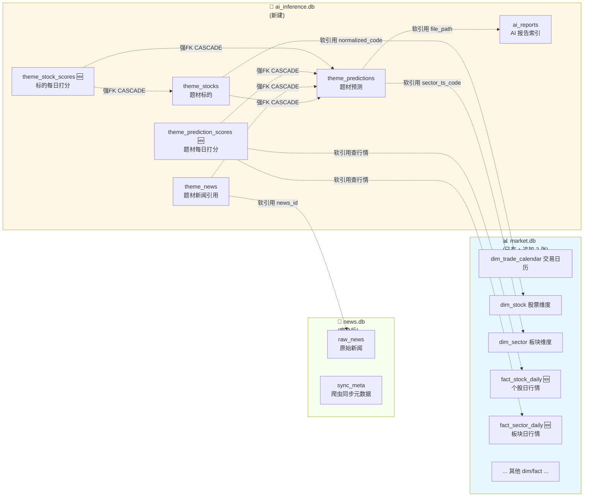

# 三库重构·表结构详细设计

> 主人审阅版（中文化每个字段，带示例）
> 编写时间：2026-05-27 12:09
> 编写人：辉夜
> 配套：[施工文档](05-27-1213-模板回测功能施工方案v3.1.md) Phase -1
> 配套：[设计通读版](05-27-1140-模板回测功能设计.md)

---

## 0. 三库职责一图流



**职责一句话总结**：
- **news.db**：只放从外面爬来的原始新闻
- **market.db**：只放从 Tushare 等接口拉来的原始市场数据 + 维度参考表
- **ai_inference.db**：所有 AI 抽出来的、算法算出来的衍生数据

**跨库关系说明**：
- **强 FK**（带 CASCADE 自动级联删）：仅限**同库**内部，跨库 SQLite 不支持
- **软引用**（用字段值匹配但无 FK 约束）：跨库引用走这种，靠应用层维护一致性

---

## 1. news.db（瘦身后只剩 2 张表）

> 重构后 news.db 只保留爬虫产物，AI 相关全搬走。

### 1.1 `raw_news` 原始新闻表

**业务定位**：爬虫抓回来的原始新闻，**主人最珍贵的不可重建数据**。

| 中文名 | 英文字段 | 类型 | 必填 | 示例 | 说明 |
|--------|---------|------|------|------|------|
| 新闻 ID | `id` | TEXT | ✅ | `news_2026_0527_001` | 主键，业务侧生成 |
| 标题 | `title` | TEXT | ✅ | "存储芯片涨价超预期" | 新闻标题 |
| 正文 | `content` | TEXT |  | （长文本） | 新闻全文 |
| 来源 | `source` | TEXT |  | "财联社" | 媒体名 |
| 发布时间 (字符串) | `published_at` | TEXT | ✅ | "2026-05-27 14:30:00" | ISO 格式 |
| 发布时间戳 | `published_ts` | INTEGER | ✅ | `1748326200` | UNIX 时间戳（防穿越用） |
| 爬取时间 | `crawled_at` | TEXT | ✅ | "2026-05-27 14:35:12" | 入库时间 |
| 清洗状态 | `clean_status` | TEXT | ✅ | `pending` / `curated` / `rejected` | 清洗流程状态 |
| 清洗理由 | `clean_reason` | TEXT |  | "重复新闻" | rejected 时填 |
| 扩展 JSON | `extra_json` | TEXT |  | `{"tags":[...]}` | 灵活字段袋 |

**索引**：`published_ts` 倒序、`clean_status`

### 1.2 `sync_meta` 同步元数据表

**业务定位**：爬虫"上次同步到哪了"等小型 KV 配置。

| 中文名 | 英文字段 | 类型 | 必填 | 示例 | 说明 |
|--------|---------|------|------|------|------|
| 键 | `key` | TEXT | ✅ | `last_crawl_ts` | 主键 |
| 值 | `value` | TEXT | ✅ | `1748326200` | 字符串化的任意值 |

---

## 2. market.db（保持现状 + 追加 2 张新表）

> 已有 `dim_trade_calendar` / `dim_stock` / `dim_sector` / `dim_trader_alias` / `fact_market_breadth` 等不动。
> 新增 2 张：用于本次回测系统的核心行情数据。

### 2.1 `fact_stock_daily` 个股日行情表 🆕

**业务定位**：A 股每只股票每个交易日的开高低收 + 涨跌幅 + 成交量。**打分模块的数据底座。**

| 中文名 | 英文字段 | 类型 | 必填 | 示例 | 说明 |
|--------|---------|------|------|------|------|
| 股票代码（带后缀） | `ts_code` | TEXT | ✅ | `600172.SH` | 主键之一 |
| 交易日 | `trade_date` | TEXT | ✅ | `20260527` | 主键之一，YYYYMMDD |
| 开盘价 | `open` | REAL |  | `12.35` | 元 |
| 最高价 | `high` | REAL |  | `12.88` | 元 |
| 最低价 | `low` | REAL |  | `12.20` | 元 |
| 收盘价 | `close` | REAL |  | `12.65` | 元 |
| 前收盘价 | `pre_close` | REAL |  | `12.30` | 元，算涨跌幅用 |
| **涨跌幅** | `pct_chg` | REAL |  | `2.85` | **百分比，打分核心字段** |
| 成交量 | `vol` | REAL |  | `1234567.5` | 手 |
| 成交额 | `amount` | REAL |  | `15234567.89` | 千元 |

**主键**：`(ts_code, trade_date)` 复合主键 → 同一只股同一天不会重复
**索引**：`trade_date` 倒序、`(ts_code, trade_date)` 倒序

**示例数据行**：
```
600172.SH | 20260527 | 12.35 | 12.88 | 12.20 | 12.65 | 12.30 | 2.85 | 1234567.5 | 15234567.89
```

**预估行数**：~5400 只股票 × 30 天 = **~16 万行/月**，~50 MB

---

### 2.2 `fact_sector_daily` 板块日行情表 ♻ 复用现有

**业务定位**：每个概念板块每个交易日的整体涨跌幅。打分模块算"板块涨幅"用。

> ⚠️ **Phase -1 调研更正（2026-05-27 13:35）**：本表**早在 market.db 001_initial.sql 中已存在**，而且已积累 14660 行数据（盘后数据自动化模块在用），字段比辉夜原设计**更丰富**。本次重构**直接复用**，不重建。

| 中文名 | 英文字段 | 类型 | 必填 | 示例 | 说明 |
|--------|---------|------|------|------|------|
| 交易日 | `trade_date` | TEXT | ✅ | `20260527` | 主键之一 |
| **板块代码** | `ts_code` | TEXT | ✅ | `BK0917.DC` | 主键之一，FK→`dim_sector.ts_code` |
| **板块涨跌幅** | `pct_chg` | REAL |  | `1.85` | **百分比，打分核心字段** |
| 主力净流入 | `main_net_yi` | REAL |  | `2.3` | 亿元（盘后模块用） |
| 超大单净流入 | `main_elg_yi` | REAL |  | `1.5` | 亿元 |
| 大单净流入 | `main_lg_yi` | REAL |  | `0.8` | 亿元 |
| 涨停数 | `limit_up_count` | INTEGER |  | `3` | 当日涨停只数 |
| 5 日累计涨幅 | `pct_chg_5d` | REAL |  | `8.5` | 派生字段 |
| 当日涨幅排名 | `rank_today` | INTEGER |  | `7` | 板块排序位 |
| 原始 JSON | `raw_json` | TEXT |  | `{...}` | Tushare 原始 dict |

**主键**：`(trade_date, ts_code)`  
**索引**：`(trade_date, pct_chg DESC)` / `(ts_code, trade_date DESC)`

**示例数据行**：
```
20260527 | BK0917.DC | 1.85 | 2.3 | 1.5 | 0.8 | 3 | 8.5 | 7 | {...}
```

**预估行数**：~480 个板块 × 30 天 = **~1.4 万行/月**

**⚠️ 打分 SQL 注意**：跨库 JOIN 时用 `m.fact_sector_daily.ts_code` 字段，**不是**辉夜最初设计的 `sector_code`（与个股 ts_code 字段名形成统一，板块代码以 `.DC` 后缀区分）。

---

## 3. ai_inference.db（新建库，共 6 张表）

> 本次重构的核心：把 AI 抽取出来的 + 算法算出来的所有数据集中管理。

### 3.1 `ai_reports` AI 报告索引表

**业务定位**：每份 AI 生成的 md 报告的"身份证"。从 news.db 迁来。

| 中文名 | 英文字段 | 类型 | 必填 | 示例 | 说明 |
|--------|---------|------|------|------|------|
| 报告 ID | `id` | INTEGER | ✅ | `123` | 自增主键 |
| 报告日期 | `report_date` | TEXT | ✅ | `2026-05-27` | YYYY-MM-DD |
| 文件路径 | `file_path` | TEXT | ✅ | `data/AI_analysis/5月27日/xxx.md` | 相对 posix 路径，唯一 |
| 模型供应商 | `provider` | TEXT |  | `deepseek` | deepseek/openai/qwen/... |
| 模型名 | `model` | TEXT |  | `deepseek-chat` |  |
| 提示词类别 | `prompt_category` | TEXT |  | `analysis` | 区分 analysis/theme_extraction/theme_review |
| 提示词代号 | `prompt_id` | TEXT |  | `speculator_scalper` | 用了哪份模板 |
| 提示词版本 | `prompt_version` | TEXT |  | `1.0` | 模板版本 |
| 新闻范围起 | `news_range_start` | TEXT |  | `2026-05-27 13:00:00` | 用了哪段时间的新闻 |
| 新闻范围止 | `news_range_end` | TEXT |  | `2026-05-27 17:30:00` |  |
| 新闻数 | `news_count` | INTEGER |  | `156` | 喂给 AI 的新闻条数 |
| 用到的盘后日期 | `used_market_date` | TEXT |  | `20260527` | 用了哪天的盘后数据 |
| 是否已抽题材 | `theme_extracted` | INTEGER | ✅ | `0` / `1` | 默认 0 |
| **是否回测产物** 🆕 | `is_backtest` | INTEGER | ✅ | `0` / `1` | **0=真实日常生成，1=虚拟回测 CLI 产物** |
| 文件大小 | `file_size` | INTEGER |  | `45678` | 字节 |
| MD5 | `md5` | TEXT |  | `abc123...` | 文件 md5（去重用） |
| 入库时间 | `created_at` | TEXT | ✅ | `2026-05-27 17:35:08` | ISO 时间 |

**索引**：`report_date` 倒序、`(prompt_id, prompt_version)`、`(theme_extracted, report_date)`、`is_backtest`

**示例数据行**（真实报告）：
```
id=123 | report_date=2026-05-27 | file_path=data/AI_analysis/5月27日/xxx.md
       | provider=deepseek | prompt_id=speculator_scalper | prompt_version=1.0
       | news_count=156 | theme_extracted=1 | is_backtest=0
```

**示例数据行**（虚拟回测产物）：
```
id=124 | report_date=2026-05-20 | file_path=data/AI_analysis/5月20日/xxx_backtest_20260520.md
       | provider=deepseek | prompt_id=speculator_scalper | prompt_version=2.0
       | news_count=142 | theme_extracted=1 | is_backtest=1
```

---

### 3.2 `theme_predictions` 题材预测表

**业务定位**：每份报告抽出来的每个题材独立一行。打分系统的核心对象。

| 中文名 | 英文字段 | 类型 | 必填 | 示例 | 说明 |
|--------|---------|------|------|------|------|
| 题材 ID | `id` | INTEGER | ✅ | `456` | 自增主键 |
| 来源报告文件名 | `report_id` | TEXT | ✅ | `5月27日_17时30分_盘后总结分析报告` | **是文件名字符串，不是 ai_reports.id** |
| 报告日期 | `report_date` | TEXT | ✅ | `20260527` | YYYYMMDD |
| 报告时间 | `report_time` | TEXT |  | `17:30` |  |
| 报告路径 | `report_path` | TEXT | ✅ | `data/AI_analysis/5月27日/xxx.md` | 相对 posix，可 JOIN `ai_reports.file_path` |
| 题材名 | `theme_name` | TEXT | ✅ | "先进封装" |  |
| 题材分类 | `theme_category` | TEXT |  | "半导体" | AI 给的大类 |
| **强度分** | `strength_score` | INTEGER | ✅ | `75` / `-40` | **-100~+100，正=利多/负=利空** |
| **强度等级** | `strength_level` | TEXT | ✅ | `中等利多` / `重大利空` | **9 档枚举，下表详细** |
| 优先级排名 | `priority_rank` | INTEGER |  | `2` | 该报告内第几位 |
| 持续性 | `duration` | TEXT |  | `1-3天` / `1周以上` | AI 判断 |
| 预期差 | `expectation_gap` | TEXT |  | `市场低估` / `已被定价` |  |
| 是否冷门 | `is_cold` | INTEGER | ✅ | `0` / `1` | 默认 0 |
| 理由 | `reason` | TEXT | ✅ | "存储芯片涨价 + Chiplet 渗透率提升" | AI 给的分析理由 |
| 风险提示 | `risk_note` | TEXT |  | "短期已涨多" |  |
| 模板代号（冗余） | `prompt_id` | TEXT |  | `speculator_scalper` | 冗余自 ai_reports，反查失败时 NULL |
| 模板版本（冗余） | `prompt_version` | TEXT |  | `1.0` |  |
| **板块代码** | `sector_ts_code` | TEXT |  | `BK1080.DC` | matcher 匹配的板块代码 |
| **板块匹配置信度** | `sector_match_conf` | REAL |  | `0.95` | 0~1，<0.6 标红 |
| **是否回测产物** 🆕 | `is_backtest` | INTEGER | ✅ | `0` / `1` | **跟着 ai_reports 透传** |
| 入库时间 | `created_at` | TEXT | ✅ | `2026-05-27 17:36:12` |  |

**索引**：`report_date` 倒序、`theme_name`、`(report_date, strength_score DESC)`、`theme_category`、`report_id`、`(prompt_id, prompt_version)`、`sector_ts_code`、`is_backtest`

#### 9 档强度等级对照

| strength_score 范围 | strength_level | 颜色 |
|---------------------|----------------|------|
| 90~100 | 重大利多 | 🟢🟢🟢 |
| 70~89 | 显著利多 | 🟢🟢 |
| 40~69 | 中等利多 | 🟢 |
| 10~39 | 轻微利多 | 🟢淡 |
| -9~9 | 中性 | ⚪ |
| -10~-39 | 轻微利空 | 🔴淡 |
| -40~-69 | 中等利空 | 🔴 |
| -70~-89 | 显著利空 | 🔴🔴 |
| -100~-90 | 重大利空 | 🔴🔴🔴 |

---

### 3.3 `theme_stocks` 题材标的表

**业务定位**：每个题材里 AI 推荐的具体股票。

| 中文名 | 英文字段 | 类型 | 必填 | 示例 | 说明 |
|--------|---------|------|------|------|------|
| ID | `id` | INTEGER | ✅ | `789` | 自增主键 |
| **题材 ID** | `theme_id` | INTEGER | ✅ | `456` | **外键→theme_predictions.id，删题材级联删** |
| 股票名 | `stock_name` | TEXT | ✅ | "上海贝岭" | AI 原文给的 |
| 股票代码（原始） | `stock_code` | TEXT |  | `600171` | AI 原文给的，可能不带后缀 |
| **标准化代码** | `normalized_code` | TEXT |  | `600171.SH` | **matcher 规范化后**，带交易所后缀 |
| 角色 | `role` | TEXT |  | `龙头` / `跟风` | AI 标的角色 |
| 入选理由 | `reason` | TEXT |  | "封装产能国内第一" | AI 解释为何选这只 |

**外键**：`theme_id` → `theme_predictions(id)` ON DELETE CASCADE
**索引**：`theme_id`、`stock_name`、`stock_code`、`normalized_code`

**示例数据行**：
```
id=789 | theme_id=456 | stock_name=上海贝岭 | stock_code=600171
       | normalized_code=600171.SH | role=龙头 | reason=封装产能国内第一
```

---

### 3.4 `theme_news` 题材新闻引用表

**业务定位**：题材关联到哪些新闻（用于复盘 AI 是基于哪些信息做的判断）。

| 中文名 | 英文字段 | 类型 | 必填 | 示例 | 说明 |
|--------|---------|------|------|------|------|
| ID | `id` | INTEGER | ✅ | `1024` | 自增主键 |
| **题材 ID** | `theme_id` | INTEGER | ✅ | `456` | **外键→theme_predictions.id，CASCADE** |
| 新闻引用字符串 | `news_ref` | TEXT | ✅ | `[news_2026_0527_001]` | AI 原文写法 |
| **新闻 ID** | `news_id` | TEXT |  | `news_2026_0527_001` | **软引用→news.db.raw_news.id**（跨库） |
| 关联类型 | `relation_type` | TEXT |  | `direct` / `related` |  |

**外键**：`theme_id` → `theme_predictions(id)` ON DELETE CASCADE
**索引**：`theme_id`、`news_id`

**软引用说明**：`news_id` 跨库引用 `news.db.raw_news.id`，SQLite 不支持跨库外键，所以**没有 CASCADE 保护**。如果 raw_news 被删，theme_news 这里会留孤儿引用 → 应用层不主动删 raw_news，没问题。

---

### 3.5 `theme_prediction_scores` 题材每日打分表 🆕

**业务定位**：每个题材在追踪期内每个交易日的得分。**主人看哪个模板准的数据来源。**

| 中文名 | 英文字段 | 类型 | 必填 | 示例 | 说明 |
|--------|---------|------|------|------|------|
| ID | `id` | INTEGER | ✅ | `2048` | 自增主键 |
| **题材 ID** | `theme_id` | INTEGER | ✅ | `456` | **外键→theme_predictions.id，CASCADE** |
| 模板代号（冗余） | `prompt_id` | TEXT |  | `speculator_scalper` | 方便聚合查询不用 JOIN |
| 模板版本（冗余） | `prompt_version` | TEXT |  | `1.0` |  |
| 报告日期 | `report_date` | TEXT | ✅ | `20260527` | 冗余 |
| **打分日期** | `score_date` | TEXT | ✅ | `20260528` | 实际打分用的那个交易日 |
| **距 D+几** | `days_offset` | INTEGER | ✅ | `1` | 1~5（D+1 ~ D+5） |
| 板块涨幅 | `sector_pct` | REAL |  | `2.30` | 当日板块涨跌幅（%） |
| 标的平均涨幅 | `stock_avg_pct` | REAL |  | `1.85` | 算术平均 |
| 加权平均涨幅 | `stock_weighted_pct` | REAL |  | `2.10` | 按强度分加权 |
| 命中数 | `hit_count` | INTEGER |  | `3` | 标的中涨幅>=阈值的数量 |
| 总标的数 | `total_count` | INTEGER |  | `5` |  |
| **命中率** | `hit_rate` | REAL |  | `0.60` | `hit_count / total_count` |
| 大盘涨幅 | `benchmark_pct` | REAL |  | `0.30` | 上证综指当日 |
| **Alpha** | `alpha` | REAL |  | `1.80` | **加权涨幅 − 大盘 = 剔除大盘的真实贡献** |
| 方向是否正确 | `direction_correct` | INTEGER |  | `1` / `0` / NULL | 看多+真涨 或 看空+真跌 = 1 |
| AI 评分员标签 | `ai_review_label` | TEXT |  | `right` / `lucky` / `wrong` | **D+5 才填，其他天 NULL** |
| AI 评分员评语 | `ai_review_comment` | TEXT |  | "扎实的产业链分析" | D+5 才填 |
| 入库时间 | `created_at` | TEXT | ✅ | `2026-05-28 17:30:05` |  |

**外键**：`theme_id` → `theme_predictions(id)` ON DELETE CASCADE
**唯一约束**：`(theme_id, score_date)` → 同一个题材同一天只能有一条
**索引**：`theme_id`、`(prompt_id, score_date)`、`score_date` 倒序

**示例数据行**（D+1 一行）：
```
id=2048 | theme_id=456 | prompt_id=speculator_scalper@1.0
       | report_date=20260527 | score_date=20260528 | days_offset=1
       | sector_pct=2.30 | stock_avg_pct=1.85 | stock_weighted_pct=2.10
       | hit_count=3 | total_count=5 | hit_rate=0.60
       | benchmark_pct=0.30 | alpha=1.80 | direction_correct=1
       | ai_review_label=NULL（D+5 才填）
```

**示例数据行**（D+5 一行，AI 评语已补）：
```
id=2052 | theme_id=456 | ... | days_offset=5
       | ai_review_label=right
       | ai_review_comment="存储涨价逻辑兑现，5 天累计 alpha=8.5% 远超大盘"
```

**5 天追踪期生成模式**：
- 一个题材在追踪期内会产生 5 条记录（D+1 ~ D+5），每天打分一次
- D+5 那条**额外**补 AI 评语
- 用 `(theme_id, score_date)` 唯一约束保证幂等

---

### 3.6 `theme_stock_scores` 标的每日打分表 🆕

**业务定位**：每只标的在每个打分日的独立得分（粒度更细，方便事后复盘哪只 AI 选错了）。

| 中文名 | 英文字段 | 类型 | 必填 | 示例 | 说明 |
|--------|---------|------|------|------|------|
| ID | `id` | INTEGER | ✅ | `4096` | 自增主键 |
| **题材标的 ID** | `theme_stock_id` | INTEGER | ✅ | `789` | **外键→theme_stocks.id，CASCADE** |
| **题材 ID** | `theme_id` | INTEGER | ✅ | `456` | **外键→theme_predictions.id，CASCADE**（双重 FK 方便聚合） |
| 标准化代码 | `normalized_code` | TEXT | ✅ | `600171.SH` |  |
| 报告日期 | `report_date` | TEXT | ✅ | `20260527` |  |
| 打分日期 | `score_date` | TEXT | ✅ | `20260528` |  |
| 距 D+几 | `days_offset` | INTEGER | ✅ | `1` | 1~5 |
| **涨跌幅** | `pct_chg` | REAL |  | `3.85` | 当日涨跌幅（%） |
| **是否命中** | `is_hit` | INTEGER |  | `1` / `0` | `pct_chg >= 阈值(默认3%)` |
| 入库时间 | `created_at` | TEXT | ✅ | `2026-05-28 17:30:05` |  |

**外键**：双重 CASCADE（删题材或删标的都会清掉对应打分）
**唯一约束**：`(theme_stock_id, score_date)`
**索引**：`theme_id`、`(normalized_code, score_date)`

**示例数据行**：
```
id=4096 | theme_stock_id=789 | theme_id=456 | normalized_code=600171.SH
       | report_date=20260527 | score_date=20260528 | days_offset=1
       | pct_chg=3.85 | is_hit=1
```

**预估行数**：一个题材平均 5 只标的，一份报告平均 4 个题材，一天 4-7 份报告，5 天追踪 → 大约 `5 × 4 × 5 × 5 ≈ 500 行/天` → ~15000 行/月

---

## 4. 跨库 JOIN 速查表

主人想知道某种查询走哪条路径时翻这里。

| 业务需求 | 主库 | ATTACH 哪个 | SQL 骨架 |
|---------|------|-----------|---------|
| 看某题材关联的新闻全文 | ai_inference.db | `news.db AS n` | `JOIN n.raw_news ON tn.news_id = n.id` |
| 给题材打分（取行情） | ai_inference.db | `market.db AS m` | `JOIN m.fact_stock_daily ON ts.normalized_code = m.ts_code AND m.trade_date = ?` |
| 题材富化板块名 | ai_inference.db | `market.db AS m` | `JOIN m.dim_sector ON tp.sector_ts_code = m.ts_code` |
| 题材富化股票名 | ai_inference.db | `market.db AS m` | `JOIN m.dim_stock ON ts.normalized_code = m.ts_code` |
| 模板评估页（聚合 + 大盘对比） | ai_inference.db | `market.db AS m` | `... GROUP BY prompt_id, prompt_version` |
| 重抽题材时反查 prompt_id | ai_inference.db | (单库即可) | `JOIN ai_reports ON tp.report_path = ai_reports.file_path` |

**ATTACH 范式**（已有 `MarketDB.attach_to`，AIInferenceDB 抄一份 `attach_to`）：
```python
from services.storage.ai_inference_db import get_ai_inference_db
from services.market.market_db import get_market_db

ai_db = get_ai_inference_db()
with ai_db.connect() as conn:
    get_market_db().attach_to(conn, alias='m')
    try:
        rows = conn.execute("""
            SELECT tp.theme_name, fsd.pct_chg
            FROM theme_predictions tp
            JOIN theme_stocks ts ON ts.theme_id = tp.id
            JOIN m.fact_stock_daily fsd 
              ON fsd.ts_code = ts.normalized_code AND fsd.trade_date = ?
            WHERE tp.report_date = ?
        """, (score_date, report_date)).fetchall()
    finally:
        conn.execute("DETACH DATABASE m")
```

---

## 5. 一次性数据清空脚本

由于主人决策"过去的分析数据相关的表内容全部清空"，迁移阶段**不迁移任何旧数据**：

```sql
-- news.db
DROP TABLE IF EXISTS theme_news;
DROP TABLE IF EXISTS theme_stocks;
DROP TABLE IF EXISTS theme_predictions;
DROP TABLE IF EXISTS ai_reports;
-- raw_news / sync_meta 保留不动
```

```python
# 新建 data/ai_inference.db 并跑 001_initial.sql 建 6 张表
# 不导入任何旧数据
```

**未来重新积累数据的路径**：
- 主人写新模板 → 跑 `tools/backtest_prompt.py` 虚拟回测 → 新数据进 ai_inference.db
- 主人日常用 AI 分析页面 → 新报告进 ai_reports（is_backtest=0）
- 已有 19 份历史 md 文件**保留在磁盘**但不批量补抽（主人决策）

---

## 6. 字段数 / 索引数 / 外键数 统计

| 库 | 表数 | 字段总数 | 索引数 | 外键数 |
|----|------|---------|--------|-------|
| news.db | 2 | 12 | 2 | 0 |
| market.db（新增的 2 张） | 2 | 16 | 4 | 0 |
| ai_inference.db | 6 | 65 | 17 | 6 |
| **合计**（本次涉及） | **10** | **93** | **23** | **6** |

---

## 7. 重构后跟当前 schema 的字段对比

### theme_predictions：v4 → v5（本次重构）

| 字段 | v4 | v5 | 变化 |
|------|----|----|------|
| `sentiment` | 有 | 无 | v4 已删 |
| `strength_score` | -100~+100 | -100~+100 | 不变 |
| `strength_level` | 9 档 | 9 档 | 不变 |
| `prompt_id` / `prompt_version` | 有 | 有 | 不变 |
| `sector_ts_code` / `sector_match_conf` | 有 | 有 | 不变 |
| `is_backtest` | 无 | **新增** | 🆕 |

### theme_stocks：v4 → v5

| 字段 | v4 | v5 | 变化 |
|------|----|----|------|
| `normalized_code` | 有 | 有 | 不变 |

→ **theme_stocks / theme_news 本次零字段变更，仅迁库**

### ai_reports：v1 → v2

| 字段 | v1 | v2 | 变化 |
|------|----|----|------|
| 现有 16 字段 | 有 | 有 | 不变 |
| `is_backtest` | 无 | **新增** | 🆕 |

---

## 8. 主人审阅 checklist

主人请逐个过一遍：

- [ ] **库分配**：3 张库的职责划分合理（news / market / ai_inference）
- [ ] **6 张 ai 表**：4 张老表迁来 + 2 张新打分表，结构清楚
- [ ] **2 张 market 新表**：个股 / 板块行情字段够用
- [ ] **9 档强度等级**：与之前 v4 决策一致
- [ ] **is_backtest 字段**：在 ai_reports + theme_predictions 都加（继承）
- [ ] **外键 CASCADE**：理解为"删父表自动删子表"
- [ ] **跨库软引用**：理解 `theme_news.news_id` 跨库无 FK 保护（应用层不主动删 raw_news）
- [ ] **清空旧数据**：news.db 的 4 张老表 DROP，磁盘上 19 份 md 保留但不补抽

---

## 9. 主人确认后辉夜要做什么

1. **更新施工文档**：插入 Phase -1（三库重构），含 9 个子任务
2. **更新通读版设计文档**：加一节「为什么改三库」+「重构对回测样本来源的影响」
3. **更新 .huiye/README.md**：状态、总工期（5.5~6 天）同步
4. **等主人最终启动确认**（Tushare 积分 / disk space / provider）后开工

---

## 10. 关联文档

- 主人通读版：[05-27-1140-模板回测功能设计.md](05-27-1140-模板回测功能设计.md)
- 流程通读版：[05-27-1025-题材抽取打分完整流程.md](05-27-1025-题材抽取打分完整流程.md)
- 施工文档（含 Phase -1）：[05-27-1213-模板回测功能施工方案v3.1.md](05-27-1213-模板回测功能施工方案v3.1.md)
- 原 v4 schema 决策：[05-27-1003-题材抽取保存与GUI补全设计.md](05-27-1003-题材抽取保存与GUI补全设计.md)
