# 功能设计·主人通读版：命中率 / 方向算法重设 · 利空全量剔除 · 题材按强度排序

> 编写时间：2026-05-29 00:58  
> 编写人：辉夜  
> 受众：主人通读审核（**禁止技术栈 / 表结构 / 函数签名 / 代码片段**）  
> 关联：[评估页报告树形展开上线](../updates/05-28-1048-评估页报告树形展开上线.md) · [α 体系金字塔重构](../updates/05-28-2230-α体系金字塔重构上线.md)

---

## 一、是什么

把 AI 题材预测的两个评估指标——**命中率** 与 **方向准确性**——按主人新口径彻底重设；同时把所有 A 股做不了空的「利空题材 + 中性题材」从打分体系里整体剔除（**不打分、不入库**）；题材列表展开默认按强度从高到低排。

一张图先让主人看明白整套口径：

```mermaid
flowchart TB
    subgraph filter ["利空与中性的处理"]
        F1["题材强度 ≤ 0<br/>(看空 + 中性)"] -->|"打分阶段直接跳过"| F2["不写打分行<br/>评估页看不到"]
        F3["题材强度 > 0<br/>(看多题材)"] -->|"正常打分"| F4["参与所有计算"]
    end
    subgraph hit ["命中率·标的日线视角"]
        H1["每个标的每个交易日"] --> H2["标的当日涨跌 减去 中证1000当日涨跌"]
        H2 --> H3{"差值 > 题材强度 / 20 ?"}
        H3 -->|"是"| H4["该日该标的命中"]
        H3 -->|"否"| H5["该日该标的未命中"]
        H4 --> H6["标的命中率<br/>命中天数 ÷ 有效打分天数"]
        H5 --> H6
        H6 --> H7["题材命中率 = 标的命中率均值"]
        H7 --> H8["报告命中率 = 题材命中率均值"]
        H8 --> H9["模板命中率 = 报告命中率均值"]
    end
    subgraph dir ["方向准确性·题材累计视角"]
        D1["每个题材每天有一个综合涨跌幅<br/>= 0.6 × 板块涨跌 + 0.4 × 标的均涨"] --> D2["累计数 = (1 + 第1天涨跌) × (1 + 第2天涨跌) × ...<br/>从 D+1 累乘到当前已打到的 D+N"]
        D2 --> D3{"累计数 > 1 ?"}
        D3 -->|"是"| D4["该题材方向准确"]
        D3 -->|"否"| D5["该题材方向不准确"]
        D4 --> D6["报告方向准确性<br/>= 准确题材数 ÷ 题材总数"]
        D5 --> D6
        D6 --> D7["模板方向准确性<br/>= 报告准确性均值"]
    end
    subgraph sort ["题材展开排序"]
        S1["报告展开后<br/>第二层题材列表"] --> S2["强度分数从大到小"]
        S2 --> S3["同强度按 priority_rank 升序兜底"]
        S3 --> S4["GUI 表头仍可手点换列排序"]
    end
```



---

## 二、为什么做（用户情景）

### 痛点 1：A 股不能做空，但库里全是利空预测的打分

当前的 AI 模板会输出大量「看空」与「中性」题材（截图里截到「微利空 -55」「较弱预期空 -45」「中性看多 +10」之类）。这些预测：

- **既不能指导买**（A 股没法做空，看空标的不能下空单）
- **也不能指导卖**（手里没货，"未来跌"对仓位没指导意义）
- **还污染统计**：命中率被一刀切的 3% 阈值算成虚高（看空标的当天涨 5% 也被记"命中"）；方向准确性指标按"反向同号"判定，让主人误以为模板对利空预测有 60%+ 的"准头"——实际上交易上一毛钱不值

主人想要的是：评估页里看到的所有命中率、方向准确性、D+N、α，都**只反映 AI 选看多题材的能力**——这才是 A 股实战中真正能用的部分。

### 痛点 2：命中率"一刀切 3%"不识题材强度

当前命中判定是「标的当日涨幅 ≥ 3% 就算命中」，**不分题材强度**：

| 当前场景 | 当前判定 | 主人吐槽 |
|---|---|---|
| 强度 +75（重大利多）的题材，标的涨 4% | 命中 | 重大利多预测才涨 4%，远低于强度暗示的"大涨"预期，凭啥算命中？ |
| 强度 +25（较弱利多）的题材，标的涨 2.5% | 未命中 | 较弱利多本来就是小涨预期，2.5% 已经接近兑现，凭啥算未命中？ |
| 大盘普涨 5%，标的涨 4% | 命中 | 跑输大盘 1%，AI 的"超额预测能力"实际为负，凭啥算命中？ |

主人要的是：**命中阈值跟着题材强度自适应，且只看跑赢中证1000 的部分（剔除大盘干扰）**。

### 痛点 3：方向准确性"单日逐次判"路径依赖太重

当前方向准确性是每天判一次（5 天判 5 次再平均），导致：

- 5 天里 1 天大幅反向（比如题材涨了 3%、3%、-8%、3%、3%）会让方向得分掉到 80%——但**整段周期累计还是正收益**，对实战交易来说方向其实是对的
- 用的是**纯板块涨跌**而非"板块加权 + 标的均涨"的题材综合涨跌，跟 D+N 这一列的口径分裂

主人要的是：**整段持仓周期的累计盈亏方向**——假设主人在 D+1 全仓买入，持有到 D+5，最终是赚是亏？赚 = 方向准确，亏 = 方向不准确。一锤定音，不被单日波动干扰。

### 痛点 4：题材展开顺序按入库 ID，找不到强势题材

当前题材列表是按入库主键升序展开——AI 输出顺序混乱时，主人得在十几个题材里翻找"哪个强度最高最值得跟"。
主人要的是：**强度高的自动顶到最上面**。

---

## 三、具体要求

### 1. 利空与中性的处理

| 维度 | 主人要求 |
|---|---|
| 题材判定 | 强度分数 **≤ 0**（即看空 + 中性）都视为利空 |
| 标的判定 | 不单独判，跟随题材——题材入选则下属标的全入选 |
| 落库时机 | **打分阶段就跳过**，不写任何打分行（数据库里看不到利空 / 中性题材的打分痕迹） |
| 历史数据 | 上线新代码前**整库清空**已有打分数据，主人手动重测；不自动跑回填 |

### 2. 命中率新算法（侧重标的日线）

**单日单标的命中判定公式**：

> 标的当日涨跌幅 减去 中证1000当日涨跌幅 大于 题材强度 / 20  ⇒ 该日该标的命中

例子（题材强度 +100、强度 +50、强度 +25 三种）：

| 题材强度 | 命中阈值（α） | 含义 |
|---|---|---|
| +100（重大利多） | α > 5% | 标的当日要跑赢中证1000 多 5% 才算命中 |
| +50（较强利多） | α > 2.5% | 跑赢中证1000 多 2.5% 算命中 |
| +25（较弱利多） | α > 1.25% | 跑赢中证1000 多 1.25% 即可 |

**聚合层级**：

```
标的命中率 = 该标的的命中天数 ÷ 有效打分天数
题材命中率 = 该题材内所有标的命中率的均值
报告命中率 = 该报告内所有题材命中率的均值
模板命中率 = 该模板下所有报告命中率的均值
```

**"有效打分天数"的定义**：该标的在 D+1 ~ D+5 里**真正有过打分**的天数。停牌 / 退市当日不打分，自然不计入分母（每次续打分时分母会跟着涨）。

### 3. 方向准确性新算法（侧重题材累计）

**题材方向判定公式（5 天累计）**：

> 累计数 = (1 + 第1天题材综合涨跌幅 / 100) × (1 + 第2天 / 100) × ... × (1 + 第N天 / 100)
> 
> 累计数 > 1 ⇒ 该题材方向准确（值 1）
> 累计数 ≤ 1 ⇒ 该题材方向不准确（值 0）

**每日"题材综合涨跌幅"取值**：

> 题材综合涨跌幅 = 0.6 × 板块涨跌幅 + 0.4 × 标的当日均涨

（与评估页 D+N 列的口径完全对齐，主人不会再看到"D+N 数据"和"方向数据"对不上的情况）

**聚合层级**：

```
报告方向准确性 = 报告内方向准确的题材数 ÷ 报告内题材总数
模板方向准确性 = 模板下所有报告方向准确性的均值
```

**"每次续打更新"语义**：D+1 打分时按 1 天累计判（累计数 = 1 + 第1天涨跌幅）；D+5 打分时按 5 天累计判。表格里每个 D+N 列能看到累计判定的演进过程，最右那一列（D+5）即最终判定。

### 4. 题材展开默认排序

| 优先级 | 排序键 | 方向 |
|---|---|---|
| 第 1 优先 | 题材强度分数 | 从大到小（强度 +80 在 +20 之前） |
| 第 2 优先 | 优先级排名（priority_rank） | 从小到大（排名 1 在排名 3 之前） |
| GUI 行为 | 表头列点击 | **仍保留可点击换列排序的能力**——主人可以临时按 D+5、α、命中率等任意列排 |

### 5. 历史打分数据处理

- 上线新代码前**整库清空** 题材打分行 与 标的打分行（旧口径数据全部废弃，避免新旧口径混着算）
- 题材本身（包含强度、标的列表、板块绑定）**保留**，主人只需手动点「重打分」按钮即可按新口径重测
- 不自动跑回填，避免主人没来得及验证就被覆盖

---

## 四、预期效果（主人做完后能看到什么）

### 4.1 评估页模板汇总表（顶层）

- 命中率列：模板级的「报告命中率均值」按新口径展示（如 `65.2%`）
- 方向准确性列：模板级的「报告准确性均值」按新口径展示（如 `78.0%`）
- 不会再出现"中性题材"或"利空题材"对均值的拉低 / 美化

### 4.2 评估页报告展开（第 1 层 → 第 2 层）

- 题材列表自动按**强度从高到低**排：`+80 重大利多` 在最上、`+20 较弱利多` 在最下
- 利空 / 中性题材**完全消失**（库里就没有打分行，列表不显示）
- 第 2 层各题材行能看到：题材命中率 / 题材方向（1 或 0） / α+N / D+N

### 4.3 评估页题材展开（第 2 层 → 第 3 层）

- 标的列表显示每只标的的：D+1~D+5 单日涨跌 / α+1~α+5 单日 α / **每日是否命中（按新阈值）** / 标的命中率（命中天数 ÷ 有效打分天数）

### 4.4 GUI 表头点击

- 默认是"强度 DESC"，但主人随时点列头能切换排序（例如想找"命中率最高的题材"，点命中率列即可）
- 排序状态不持久化，关掉重开还是回到"强度 DESC"默认

### 4.5 题材详情页 / CSV 导出

- CSV 同步反映新口径，导出的命中率 / 方向准确性字段含义统一
- 历史 CSV 与新 CSV 不可混着看（**口径变了**，旧 CSV 里的 65% 命中率与新 CSV 的 65% 完全是两件事）

---

## 五、决策点（已与主人锁定）

| # | 决策项 | 主人选择 |
|---|---|---|
| 1 | 利空判定边界 | **强度分数 ≤ 0** 都算利空（含中性 0） |
| 2 | 标的判定方式 | **不单独判**，跟随题材入选 |
| 3 | 打分阶段落库时机 | **打分阶段直接跳过**，不写任何打分行 |
| 4 | 命中率判定单位 | **标的级 + 日级**（不是题材级累计） |
| 5 | 命中率视角 | **α 命中**（标的涨跌 减去 中证1000 涨跌） |
| 6 | 命中阈值公式 | **题材强度 ÷ 20**（强度 100 → α > 5%，强度 25 → α > 1.25%） |
| 7 | 命中率聚合 | 标的 → 题材 → 报告 → 模板，**每层均值** |
| 8 | 命中率分母 | **有效打分天数**，每次续打更新（停牌天数不计入） |
| 9 | 方向判定单位 | **题材级 + 5 天累计**（不是单日逐次判） |
| 10 | 方向涨跌幅口径 | **题材综合涨跌**（0.6·板块 + 0.4·标的均涨），与 D+N 同口径 |
| 11 | 方向累计公式 | **∏(1 + 涨跌幅 / 100) > 1** 即方向准确 |
| 12 | 方向存表方式 | **每次续打更新**（D+1 行存 1 天累计判定、D+5 行存 5 天累计判定） |
| 13 | 方向聚合 | 题材级 1/0 → 报告级 准确数/总数 → 模板级 报告均值 |
| 14 | 历史数据处理 | **整库清空**已有打分行（题材本身保留），主人手动重测 |
| 15 | 题材列表排序 | **强度分数 DESC，相同强度按 priority_rank ASC 兜底**，GUI 表头仍可手点换列 |

---

## 六、Q&A（预想主人会问的）

**Q1：为什么不只过滤利空、而是把中性（强度 = 0）也剔除？**  
A：A 股做不了空，"中性看多" / "中性看空" 这种含糊预测既不指导买入、也不指导卖出，参与统计反而稀释看多题材的真实信号。剔除后所有评估指标专门反映"AI 选看多题材的能力"——这是 A 股实战里唯一能用的能力。

**Q2：标的级命中率分母用"有效打分天数"会不会让"只打了 1 天"的标的命中率虚高？**  
A：会有这个倾向。但 GUI 上会同时显示"有效天数"，主人能一眼看出 `100% (1/1)` 是数据少。后续若主人觉得不够稳健，可以再加一条规则"有效天数 < 3 天的标的不参与题材级聚合"——这是未来扩展项，本期先简单做。

**Q3：方向用累乘（(1+r₁)(1+r₂)...）而不是简单相加（r₁+r₂+...）有什么差别？**  
A：累乘更接近真实持仓收益——比如一天跌 50%、第二天涨 50%，简单相加得 0（看着像没赚没亏），累乘是 (1-0.5)(1+0.5) = 0.75（实际亏 25%）。主人的累乘公式更严格，反映"在 D+1 全仓买入持有到 D+5"的真实回报方向。

**Q4：历史数据清空后，旧报告还能看吗？**  
A：能看。**清空的只是"打分行"**（5 天的 D+N / α / 命中率 / 方向数据），题材本身（强度、标的、板块绑定）和报告本身（md 文件、原始 AI 输出）都保留。主人在评估页点「重打分」按钮即可按新口径重测，无需重新跑 LLM 推理。

**Q5：命中率分母如果某标的连停 5 天怎么办？**  
A：分母 = 0，标的命中率为空（不参与题材均值）。这是合理的——5 天连停的标的本身就没法评估 AI 选股能力。GUI 上会显示"—"或"无数据"。

**Q6：方向准确性 D+1 时只有 1 天数据，累计数 = 1 + r₁，怎么判？**  
A：按公式算就行——D+1 当天涨了（r₁ > 0）累计数 > 1 → 准确；D+1 跌了（r₁ < 0）累计数 < 1 → 不准确。表格里这一列让主人能看到"方向是否一开始就走对"。但**真正一锤定音的是 D+5 那一列**——主人聚合层看的也是 D+5 那个值（题材级 5 天累计判定 1/0）。

**Q7：旧的题材级 α、α-1 这些金字塔指标怎么办？要不要也按这次口径调整？**  
A：本次**不动 α 体系**。α / α-1 / α+N 是 2026-05-28 22:30 重构上线的，与命中率 / 方向并存为两套独立评估视角：
- α 体系：看"题材综合涨幅 相对中证1000 跑赢多少"——量化超额收益幅度
- 命中率：看"标的级日线兑现频率"——量化稳定性
- 方向准确性：看"5 天累计能否赚钱"——量化交易实战可用性

三套视角互补，主人在评估页能同时看到。

**Q8：清空了打分行，调度器明早自动跑会不会重新写入利空题材的打分？**  
A：不会。本次改造**改的就是打分引擎本身**——上线后调度器每日自动打分时遇到利空 / 中性题材直接跳过，库里永远不会再出现这类打分行。
